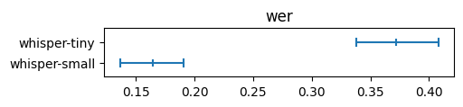
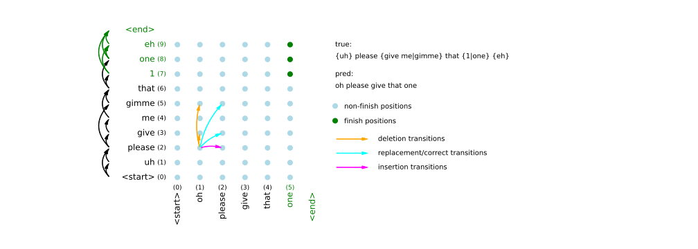

Alignments and WER
#############################

In this guide we first provide quick start examples. Then we
describe in details the processing pipeline, from tokenizing to
dataset summarizing. Finally, we describe our alignment algorithm
from the mathematical point of view.

Quick start
================

.. admonition:: Installation

    For current section, installing via :code:`pip install asr_eval`
    will be enough. See :doc:`guide_installation` for more details.

What is Word Error Rate?
------------------------------------------

`Word Error Rate (WER) <https://en.wikipedia.org/wiki/Word_error_rate>`__
is a ratio of wrongly transcribed words, including missing or extra words.

.. math::

   WER = \frac{\text{Insertions} + \text{Deletions} + \text{Replacements}}{\text{Number of words in the annotation}}

To calculate it, we take the predicted transcription and the annotation,
and split both of them into words. Then we perform a sequence alignment
to match both word sequences. This is best shown with an example below.

Aligning against multi-reference transcription
-------------------------------------------------

*asr_eval* supports multi-reference and wildcard syntax for annotation.
Imagine a child interrupts a blogger with a babble. We have difficulty
recognizing this speech, and the transcription model might even skip it
altogether as a background speech/vocalizations, which is not a mistake. Therefore, we
annotate it as :code:`<*>`:

.. testcode::

    true = '{Now...} now take a plank {1|one} {m|meter|metre} long. <*> Well!'
    pred = 'No! Take blank one meter long, Daddy, daddy. Well!'

Let's tokenize it with the :const:`~asr_eval.align.parsing.DEFAULT_PARSER`
and align with the :class:`~asr_eval.align.alignment.Alignment` class:

.. testcode::

    from asr_eval.align.alignment import Alignment
    from asr_eval.align.parsing import DEFAULT_PARSER

    true_parsed = DEFAULT_PARSER.parse_transcription(true)
    pred_parsed = DEFAULT_PARSER.parse_single_variant_transcription(pred)

    alignment = Alignment(true_parsed, pred_parsed)
    metric, errors = alignment.error_listing(max_consecutive_insertions=4)
    print('WER:', metric.word_error_rate(clip=True))

.. testoutput::

    WER: 0.375

Let's see how it was aligned:

.. testcode::
    :skipif: True

    from IPython.display import display, HTML  # doctest: +SKIP
    display(HTML(alignment.render_as_text(color_mode='html')))  # doctest: +SKIP

.. raw:: html

    true |  {Now...}  now  take  a  plank  {1|one}  {m|meter|metre}  long  <*>          Well  pred |            No   Take     blank  one      meter            long  Daddy daddy  Well 

We see that :code:`<*>` was aligned with "Daddy, daddy", "a" was skipped in the transcription
and thus considered a mistake, and the repetition "Now..." is marked as optional: skipping it is
not a mistake. Overall, we found 3 mistakes, and the ground truth length is 8 words (in each
multi-reference blocks we consired the shortest option), thus WER = 3/8 = 0.375.

We can also visualize how the texts were split into words. In general, each multi-reference
option can contain more than one word.

.. testcode::
    :skipif: True

    from IPython.display import display, HTML
    display(HTML(true_parsed.colorize(color_mode='html')))
    display(HTML(pred_parsed.colorize(color_mode='html')))

.. raw:: html

    

    {Now...} now take a plank {1|one} {m|meter|metre} long. &lt;*&gt; Well!
     
    No! Take blank one meter long, Daddy, daddy. Well!
    

The resulting :class:`~asr_eval.align.metrics.Metrics` object contains more information:

.. testcode::

    print(metric)

.. testoutput::

    Metrics(true_len=8, n_replacements=2, n_insertions=0, n_deletions=1)

Let's enumerate all the errors:

.. testcode::

    for error_pos in errors.values():
        print(f'Predicted "{error_pos.pred_text}" instead of "{error_pos.true_text}"')

.. testoutput::

    Predicted "no" instead of "now"
    Predicted "" instead of "a"
    Predicted "blank" instead of "plank"

.. admonition:: WER settings

    In the example, we use :code:`max_consecutive_insertions=4` to treat
    more than 4 consecutive insertions as exactly 4 (relaxed insertion penalty)
    and :code:`clip=True` to clip WER between 0 and 1. Remove this paramters if
    this is not needed in your case, to get the standard WER.

.. admonition:: Performance note

    Currently, our alignment algorithm can be slow for long recordings
    (10+ minutes of speech). While our algorithm is O(n^2), same as the
    Needleman–Wunsch algorithm, our implementation
    (:func:`asr_eval.align.solvers.dynprog.solve_optimal_alignment`) is pure
    Python-based and may be inefficient. We plan to speed up the code soon.

.. _multiple_alignment_rendering:

Multiple alignment
---------------------------

Let we have several different transciptions. We align them all
against the annotation and display in one block:

.. testcode::

    from asr_eval.align.alignment import Alignment
    from asr_eval.align.parsing import DEFAULT_PARSER
    from asr_eval.align.alignment import MultipleAlignment

    true = '{Now...} now take a plank {1|one} {m|meter|metre} long. <*> Well!'
    preds = {
        'model1': 'No, no! Take a blank one meter long, Daddy, daddy. Well!',
        'model2': 'NOW TAKE A PLANK 1 METRE LONG DADDY DAAA WELL',
        'model3': 'no now I\'ll take a blank 1 M long',
    }
    true_parsed = DEFAULT_PARSER.parse_transcription(true)
    alignments = {
        name: Alignment(true_parsed,
            DEFAULT_PARSER.parse_single_variant_transcription(pred))
        for name, pred in preds.items()
    }
    ma = MultipleAlignment(true_parsed, alignments)

.. testcode::
    :skipif: True

    from IPython.display import display, HTML
    display(HTML(ma.render_as_text(color_mode='html')))

.. raw:: html

    

    true   |  {Now...}  now      take  a  plank  {1|one}  {m|meter|metre}  long  <*>          Well  model1 |  No        no       Take  a  blank  one      meter            long  Daddy daddy  Well  model2 |            NOW      TAKE  A  PLANK  1        METRE            LONG  DADDY DAAA   WELL  model3 |  no        now I ll take  a  blank  1        M                long                    
    

Character error rate
---------------------------

You can find the example of defining a custom parser
that enables CER calculation instead of WER in :ref:`this section <custom_parser>`.

.. _summarizing_a_dataset:

Summarizing a dataset
---------------------------

.. admonition:: Installation

    For this section, we need a support for ASR models and datasets. Please
    install the required packages:

    :code:`pip install asr_eval[datasets] "torch==2.8.*" "torchaudio==2.8.*" torchcodec==0.7 transformers`
    
    Refer to the :doc:`guide_installation` for more ASR models.

Let's retrieve a Russian dataset Podlodka-speech. It is annotated
with a normal single-reference annotation.

.. testcode::

    from asr_eval.bench.datasets import get_dataset
    from asr_eval.models.whisper_wrapper import WhisperLongformWrapper
    from tqdm.auto import tqdm

    dataset = get_dataset('podlodka')
    print(dataset)

.. testoutput::

    Dataset({
        features: ['audio', 'transcription', 'episode', 'title', 'sample_id'],
        num_rows: 20
    })

We now run the model for each sample and align the results.

.. testcode::
    :skipif: True

    from dataclasses import dataclass, field
    from asr_eval.align.alignment import ErrorListingElement, Alignment
    from asr_eval.align.metrics import Metrics
    from asr_eval.align.parsing import DEFAULT_PARSER
    from asr_eval.models.base.interfaces import Transcriber
    from datasets import Dataset

    @dataclass
    class RunResults:
        alignments: list[Alignment] = field(default_factory=list)
        metrics: list[Metrics] = field(default_factory=list)
        errors: list[list[ErrorListingElement]] = field(default_factory=list)

    def run_on_dataset(dataset: Dataset, model: Transcriber) -> RunResults:
        results = RunResults()

        for sample in tqdm(dataset):
            pred = model.transcribe(sample['audio']['array'])
            
            pred_parsed = DEFAULT_PARSER.parse_single_variant_transcription(pred)
            true_parsed = DEFAULT_PARSER.parse_transcription(sample['transcription'])
            alignment = Alignment(true_parsed, pred_parsed)
            metric, errors_for_sample = alignment.error_listing()

            results.alignments.append(alignment)
            results.metrics.append(metric)
            results.errors.append(list(errors_for_sample.values()))
        
        return results

    model = WhisperLongformWrapper('openai/whisper-tiny')
    whisper_tiny_results = run_on_dataset(dataset, model)

Now let's calculate dataset WER and bootstrap intervals.

.. testcode::
    :skipif: True

    import numpy as np
    from asr_eval.align.metrics import DatasetMetric

    metrics = whisper_tiny_results.metrics

    print(f'WER (macro-averaging): {np.mean([m.word_error_rate() for m in metrics]):.3f}')
    print(f'WER (micro-averaging): {sum(metrics).word_error_rate():.3f}')

    # use wer_averaging_mode='concat' (default) for micro-averaging
    # and 'plain' for macro-averaging
    dataset_metric = DatasetMetric.from_samples(metrics, wer_averaging_mode='concat')
    wer_lower, wer_upper = dataset_metric.wer.quantiles((0.1, 0.9))
    print(f'WER (micro-averaging) bootstrap interval: ({wer_lower:.3f}, {wer_upper:.3f})')

.. testoutput::
    :skipif: True

    WER (macro-averaging): 0.363
    WER (micro-averaging): 0.372
    WER (micro-averaging) bootstrap interval: (0.338, 0.408)

Now let's add another model and compare them on plots. By default plots
use (0.1, 0.9) bootstrap quantiles for confidence intervals.

.. testcode::
    :skipif: True

    from asr_eval.align.metrics import DatasetMetric
    from asr_eval.align.metrics import plot_dataset_metric

    model = WhisperLongformWrapper('openai/whisper-small')
    whisper_small_results = run_on_dataset(dataset, model)

    plot_dataset_metric({
        'whisper-small': DatasetMetric.from_samples(whisper_small_results.metrics),
        'whisper-tiny': DatasetMetric.from_samples(whisper_tiny_results.metrics),
    }, what='wer')

We discuss model comparison in more details in the next sections.

Fine-grained analysis for a dataset
------------------------------------

Let's now analyze which words are most frequently transcribed wrongly.

.. testcode::
    :skipif: True

    all_errors = sum(whisper_tiny_results.errors, [])

    from collections import defaultdict
    from collections import Counter

    errs_grouped: dict[str, list[str]] = defaultdict(list)
    for err in all_errors:
        if err.true_text and len(err.true_text) > 3:  # skip insertions and short words
            errs_grouped[err.true_text].append(err.pred_text)

    # sort by number of errors
    errs_grouped_sorted = sorted(errs_grouped.items(), key=lambda x: -len(x[1]))

.. testcode::
    :skipif: True

    for true_text, pred_texts in errs_grouped_sorted[:10]:
        deleted = [p for p in pred_texts if not p]
        replaced = [p for p in pred_texts if p]
        most_common_replaced = [w for w, _i in Counter(replaced).most_common(3)]
        print(
            f'"{true_text}" was replaced {len(replaced)} times: {most_common_replaced}'
        )

.. testoutput::
    :skipif: True

    "нейронные" was replaced 4 times: ['неронной', 'неронные', 'нейроносите']
    "наше" was replaced 3 times: ['наши']
    "кандидатов" was replaced 3 times: ['полкандитатов', 'кандитатов']
    "этот" was replaced 2 times: ['это']
    "нету" was replaced 2 times: ['нет']
    "тимлидом" was replaced 2 times: ['темлидом']
    "пайплайн" was replaced 2 times: ['pipeline', 'поеплайн']
    "всего" was replaced 2 times: ['его', 'все']
    "задаче" was replaced 2 times: ['задачи']
    "данные" was replaced 2 times: ['данный', 'самеданной']

This quickstart section showcased the possibilities of the
:mod:`~asr_eval.align` module. The next section describes in more
details all stages of the evaluation pipeline and discusses the challenges.

Detailed processing pipeline
==============================

This section is in progress.

We plan to describe the following in more detail:

1. **Tokenization and parsing.** When labeling a dataset, the annotator should be
aware of the tokenization scheme. For example, if :code:`3/4$` is tokenized as
a single word, then :code:`3/4$` and :code:`3 / 4 $` (with spaces) are different
options, and both should be included in a multi-reference block. If we annotate
only "3/4$", then a prediction "3 / 4 $" will be considered 4 errors. On the other
side, if we split by space, we need to enumerate a lot of options for "3/4$!".
The current regexp treats as word either a continuous sequence of word characters
only (:code:`\\w+`), or a continuous sequence of :code:`[^\\w\\s{PUNCT}]+` - that is,
a sequence of any characters excluding letter, space or punctuation ones.
Thus, in the above example, there is no punctuation symbols, and the result will
be the same ["3", "/", "4", "$"] for both "3/4$" and "3 / 4 $". However, there are
still limitations with our method: for example, if "16-й" is a correct transcription,
then "16 й" will always be considered correct. We will also discuss a well-known
:code:`nltk.wordpunct_tokenize` algorithm that searches for either :code:`\\w+`
or :code:`[^\\w\\s]+` matches. It does not allow to separate symbols such as dollar
sign from punctuation: *"$!"* will be considered a single token. Finally, we will
descibe our :class:`~asr_eval.align.transcription.Transcription` format which keep
the positions of each tokenized word in the original text.

.. testcode::

    from asr_eval.align.parsing import DEFAULT_PARSER

    text = (
        '(7-8 мая) в Пуэрто-Рико прошёл {шестнадцатый|16-й|16}'
        ' этап "Формулы-1" с фондом 100,000$!'
    )

    transcription = DEFAULT_PARSER.parse_transcription(text)

.. testcode::
    :skipif: True

    from IPython.display import display, HTML
    display(HTML(transcription.colorize(color_mode='html')))  # doctest: +SKIP

.. raw:: html

    (7-8 мая) в Пуэрто-Рико прошёл {шестнадцатый|16-й|16} этап "Формулы-1" с фондом 100,000$!

2. **Alignment and slots.** We will describe how the our
:class:`~asr_eval.align.alignment.Alignment` class constructor calls
:func:`asr_eval.align.solvers.dynprog.solve_optimal_alignment` (for which we also
have a legacy recursive implementation
:func:`asr_eval.align.solvers.recursive.solve_optimal_alignment`), and processes
the results. We will describe the internal concept of "slots". In short, each slot
represents a specific position in the ground truth: before, at or after a word in
the ground truth. However, things become more complicated for multi-reference
transcription where we have inner and outer slots.

3. **Multi-reference WER**. For multi-reference annotations, defining WER is not straightforward.
Selecting a specific variant in a multi-reference block also affects
the reference length. Let we compare the prediction "B" against the
reference "{A | B B B}". If we select option "A", we get edit distance
1 and WER = 1. If we select option "B B B", we get higher edit distance
2 but lower WER = 2/3. Our alignment algorithm minimizes edit distance,
as usual, but in rare cases this may not minimize WER in multi-reference
annotations. This is not a big problem, though, because in WER metric the
denominator plays the same role as sample weights. If we always use 1 as
the denominator, this will be a sum of edit distances for all samples,
that is similar to calculating WER on concatenation of samples, that is
also a valid method. So, choosing a correct denominator is not crucial.

3. **Multiple alignment.** We will discuss multiple alignments. Note that we
do not align multiple predictions against each other, but align the all against
the ground truth (or the baseline prediction for unlabeled data). The
:class:`~asr_eval.align.alignment.MultipleAlignment` class forms a table, where
predictions are rows, and columns represent outer slots in the ground truth.
In the rendering stage, we add the required count of spaces to make all cells
in each column equally wide. Then we add ANSI color codes or HTML tags to mark
errors.

4. **Dataset averaging.** Our experimental framework, described in
:doc:`/guide_evaluation_dashboard`, saves inference results incrementally, sample
by sample. This is convinient in many cases, but complicates model comparision.
We fisrt need to extract a set of samples for which all models generated predictions,
and average by this set. We will discuss averaging modes (such as micro-
and macro-averging) and confidence intervals. Interestingly, the difference
between models can be statistically significant even if their confidence intervals
overlap, what we will describe with examples.

Alignment algorithm
==============================

Our algorithm is a generalization of the Needleman–Wunsch algorithm to support multi-choice blocks
and wildcard blocks (matching any sequence, possibly empty) for both sequences.

**Flat view.** We start by converting a multivariant annotation into a "flat view". Our example contains 9 tokens (words) in total,
including those inside and outside multivariant blocks. We arrange them into a list, prepend <start> and append
<end> position. Then we define transitions between them, according to the multivariant structure. In our example,
from the "<start>" word we can transit to "uh" or to "please" (skipping the {uh} optional block). The transitions
are denoted as arrows on the vertical axis (for truth) and on the horizontal axis (for prediction).

**Matrix position.** It's clear that a position in a resulting matrix means some pair of locations. More precisely,
the matrix position "at token A in the annotation and token B in the prediction" means that these tokens were the
last tokens we visited, that is, we are immediately after these tokens.

**Matrix transition (step).** A "step" is a transition between matrix positions. There are 3 types of transitions:

1. Vertical: transition over the annotation only. This means a "deletion" in terms of sequence alignment,
   because we go to the next token at the annotation while staying on the same position at the prediction.
2. Horizontal: transition over the prediction only. Similarly, this means an "insertion".
3. Diagonal: transition over both the prediction and the annotation. This means either "correct" or "replacement",
   depending on whether the tokens match or not.

**Step score.** Each step is associated with a score 0 or 1, depending on how much did the total number of errors increase after
the step. A diagonal step may have a score 0 or 1, depending on whether the tokens match or not. The horizontal
step is always 1, except cases where the current annotation token is wildcard - the score is 0 in this case,
because we can step over any count of prediction tokens being at wilcard annotation token without incrementing error
counter. The same for vertical step (however, the wildcard tokens in the prediction normally should not occur).

That is, we can traverse the matrix from the left lower to the right upper corner, or vice versa, and thus build an
alignment, resulting in a final score (number of word errors) where we finish traversing both sequences.

**Position score and best path.** We define the best path for position as the lowest score path from the end
to the current position. This is the same as the best alignment between the remaining parts of both sequences
(from the current position to the end). The position score is a score of its best path. Our final goal is to find
the best path for the (<start>, <start>) matrix position - this will be the optiomal sequence alignment.

**Final positions.** To start with, we define as "final" all the annotation positions leading directly to the <end>
position, and the same for the prediction positions. In our example, 1 prediction position and 3 annotation positions
are final (green), and the corresponding steps to the <end> are shown in green. We define a "final matrix position"
as a combination of final annotation position and final prediction position (green dots). Being in a final martrix
position, we are after final tokens in both sequences, that is essentially at the end. So, best path are empty for
the final matrix positions, and their scores are zero.

Now we are going to fill the matrix from the final positions to the (<start>, <start>) position.

**Matrix filling.** Consider some matrix position X with unknown score and best path. Let S be a set of all matrix
positions where we can get to in one step from X. In our example, the position X=("please", "oh") contains 5 positions in S(X):
2 for vertical steps, 2 for diagonal and 1 for horizontal. Let's assume that we know a position score for all
positions in S(X). For each Xs ∈ S(X), we can calculate step_score(X, Xs) + score(Xs), and take the argmin across
S(X) to find the best source position X*. Thus, score(X) = step_score(X, X*) + score(X*), and the best path for X
consists of one step to X* plus the best path for X*.

Using the described process, we fill the whole matrix, starting from the last row from right to left, then
the next row, and so on. Alternatively, we can fill the matrix column-wise or even diagonal-wise (which is the best
to parallelze computations). Finally, we got a score for the position (<start>, <start>), which is the total
number of word errors. To restore the best path (the alignment), it's enough to keep the source position for
each matrix position, and restore the path iteratively.

**Complexity.** Let A be the total word count in the annotation, and B be the total word count in the prediction.
Also, let S(X) be bounded above (which is always the case in real multi-reference annotations). The complexity
is O(AB) for the matrix propagation, since the number of operations to fill a cell is bounded above.
The complexity of restoring the best path is O(max(A, B)) that is negligible comparing to O(AB). Thus, the overall
complexity is O(AB). Since transcriptions B usually have length similar to the annotation A, the complexity is
quadratic, as in the Needleman–Wunsch algorithm.

**Improved scoring.** There may be many cases where the argmin of step_score(X, Xs) + score(Xs) contains more
than one source positions. This reflects the fact that there may be many optimal alignments. Across them all,
we want to select those in which:

1. The number of correct matches is the highest.
2. The mismatched words have the least number of discrepancies in symbols.

This is straightforward to implement. Initially, we have a single score:

.. code-block:: none

    n_errors = n_replacements + n_deletions + n_insertions

We replace n_errors with a tuple of three scores:

1. n_errors
2. The number of correct matches in the path
3. Sum character errors for all the transitions int the path

These tuples are compared lexicographically: to compare (A1, B1, C1) with (A2, B2, C2) we first
compare A1 with A2, if equal we compare B1 and B2, and if equal we finally compare C1 and C2. This ensures
that the resulting best path is still optimal in terms of n_errors.

One possible alternative is to align on a character level (calculating CER instead of WER). Our algorithm
is applicable also for this case. Note that such an alignment will not always be optimal in WER sense. This
is stll a valid alternative, however, CER have its own biases (for example, it underestimates errors in word
endings, since it's only one or two characters).