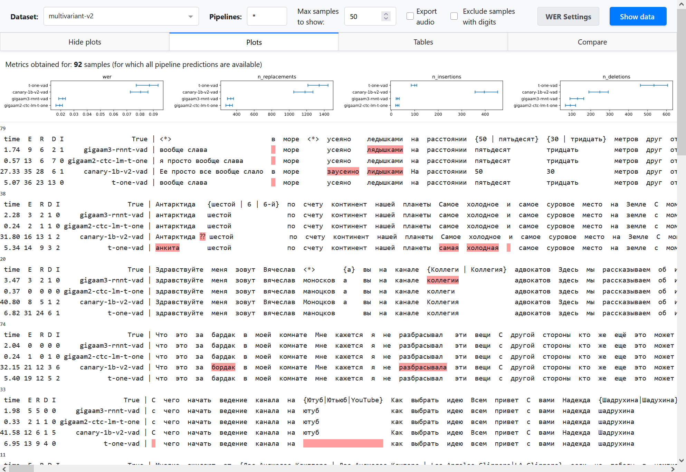
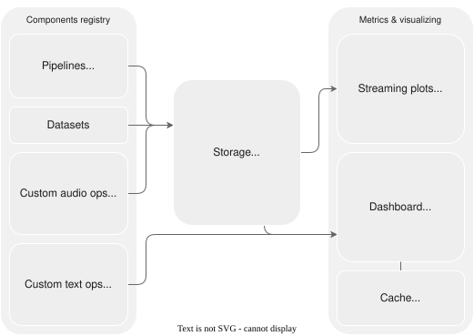
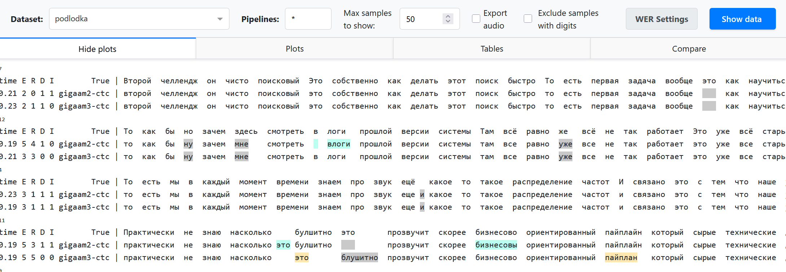
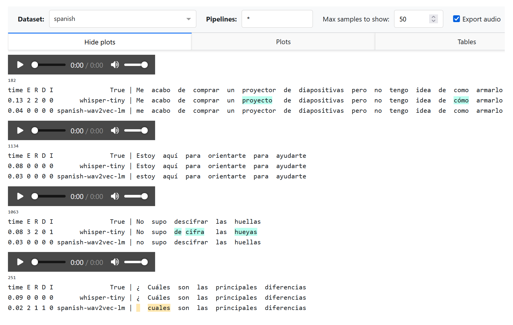
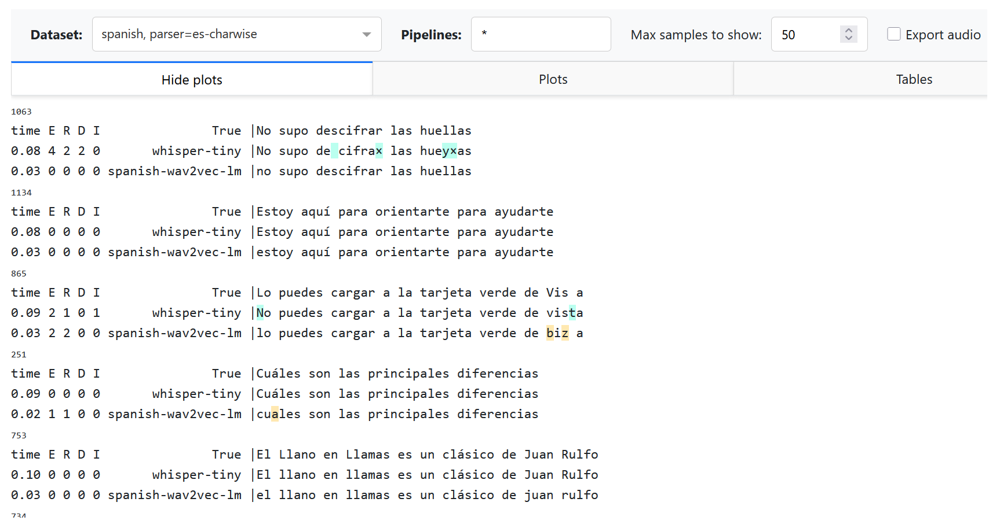
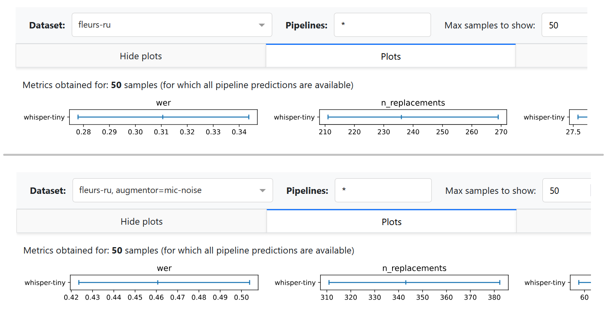

Evaluation and dashboard
#############################

This guide contains 4 parts:

1. :ref:`Dashboard quickstart. <eval_dashboard_quickstart>`
   A quickstart from a CSV file with transcriptions.
2. :ref:`Framework overview. <eval_dashboard_overview>`
   An overview of our ASR-specific experimental framework.
3. :ref:`Framework recipes. <framework_quickstart>`
   Adding datasets, models, running inference and dashboard.
4. :ref:`Datasets usage. <organizing_datasets>`
   More details about the datasets in *asr_eval*.

.. _eval_dashboard_quickstart:

Dashboard quickstart
======================

.. admonition:: Installation

    For this section, please install the following packages:
    :code:`pip install asr_eval[datasets,normalize,dash]`.
    Refer to the :doc:`guide_installation` for more ASR models.

The *asr_eval* package provides a dashboard to compare multiple models on multiple
datasets, customize WER calculations and compare normalization strategies. This section
describes a standalone dashboard usage, where both annotations and predictions
are provided as CSV files.

We will use the example files provided in the *docs/examples* folder in the repo:

- **predictions.csv** contains predictions
  and inference timings for GigaAM-v3-RNNT, GigaAM-v2-CTC and Whisper-v3-large
  on the first 20 samples of the dataset :ref:`multivariant_v2 <multivariant_v2>`.
- **annotations.csv** contains the ground truth transcriptions for this dataset.
  As we descibe a standalone usage, we exported them into a separate CSV file.

Run the dashboard as follows:

.. code-block:: bash

    cd docs/examples  # the csv files directory
    python -m asr_eval.bench.dashboard.run -s predictions.csv -a annotations.csv

After the script prints "Dash is running", open the provided URL, by
default http://localhost:8051.

------------

Some useful command line options (see
:mod:`asr_eval.bench.dashboard.run <asr_eval.bench.dashboard.run>` docs for details):

- Use :code:`--host 0.0.0.0` to be able to connect from other IPs.
- Use :code:`-d dataset(s)`, :code:`-p pipeline(s)` to load only the specified
  datasets/pipelines from the file.
- Use :code:`-c ./dashboard_cache` to cache the string alignments into the specified
  cache directory. Note that if you change the predictions or annotations file,
  the cache will no longer be valid and you need to delete it.
- You can omit :code:`-a` (:code:`--annotations`) for datasets
  registered in *asr_eval* (see :doc:`/guide_datasets_list`).
  You can also register custom datasets (see below).

To prepare your own data instead of example *predictions.csv* and *annotations.csv*,
use the same format. You also can omit the "elapsed_time" rows in the CSV.

The dashboard selectors
-----------------------------

The dashboard provides the following settings which are applied on "Show data":

**⚙️ Dataset selector.** Select one of the datasets found in the predictions
file. When using custom tokenizers or normalizers, this will
also show which tokenizer or normalizer is used.

**⚙️ Pipelines selector.** Select one or more speech recognition pipelines
to compare. By default, the asterisk means to select all the pipelines
found in the predictions file. You can use any 
`wcmatch <https://facelessuser.github.io/wcmatch/fnmatch/>`__ expression
to filter pipelines. For example, type :code:`*whisper*|*giga*|!*vad`
to select any pipeline name that contains *whsiper* or *giga*, but does
not end with *vad*. This is useful when you compare plenty of configurations.

**⚙️ Max samples to show.** Limit the count of rendered sample to icnrease performance.

**☑️ Export audio.** If checked, on "Show data" will show a button to play
each sample as audio. Note that this will result in error if the dataset
is not registered in *asr_eval*, but only annotations are provided (see
below how to register custom datasets). The audio is exported into the
*tmp/dashboard_assets* directory (can be overriden with *--assets_dir*).
You also can run the dashboard with *--export-audio* to pre-export all
audio samples for all datasets, otherwise they will be exported on
"Show data" click that may increase waiting time.

**☑️ Exclude samples with digits.** Will omit all samples that contain digit
symbols 0-9 either in the annotation or in one of the predictions, and
also exclude them from averaged metric calculation. This may be useful
to mitigate issues with normalization of numerals. However, this introduces
a spurious dependency between the pipeline set and the sample set. Also,
this is meaningless for datasets with multi-reference labeling, such
as multivariant-v2.

**☑️ WER Settings -> Count absorbed insertions.** When not checked, modifies
WER calculations so that cases such as *"nothing" -> "no thing"* are treated
as one word error but not two errors. The effect is usually negligible. See
:meth:`~asr_eval.align.alignment.Alignment.error_listing` for details.

**⚙️ WER Settings -> Max consecutive insertions.** When checked, treats more
than X insertions (4 by default) as exactly 4, to stabilize metric against
oscillatory hallucinations. See
:meth:`~asr_eval.align.alignment.Alignment.error_listing` for details.

**⚙️ WER Settings -> Averaging mode.** If "concat" (default), uses
micro-averaging across samples, if "plain" uses macro-averaging. See
:ref:`Summarizing a dataset <summarizing_a_dataset>` for details.

The dashboard outputs
-----------------------------

On **Show data** click the dashboard shows multiple alignments. Besides
highlighting errors, it shows sample id (a number above alignment),
inference time (if provided) and the numbers of replacements (R),
deletions (D), insertions (I) and total errors (E).

In the **Plots and Tables sections**, it summarizes the metric over all
the dataset to compare pipelines, using bootstrapping with quantiles
0.1 and 0.9 to determine confidence intervals
(see :ref:`Summarizing a dataset <summarizing_a_dataset>` for details).
The breakdown of the average WER into *n_replacements*, *n_insertions*
and *deletions* plots can provide insights into model comparison.

**Partial and incremental inference** is enabled in our framweork for quick
prototyping. However, this may lead to complexities in model comparison.
We should compare pipelines on equal set of samples.
To summarize metric, the dashboard uses *only those samples for which
all the provided pipelines have predictions*. For example, if pipelines
A and B have 100 predictions, and
pipeline C have only a prediction for 10 samples, the metric averaging will
be performed over 10 samples (that is stated explicitly above the plots).
To avoid such a situation, it is also possible to reject pipelines with
partial predictions using :ref:`dataset specs <dataset_specs>` in command
line arguments.

In the **Compare section**, you can compare a pair of pipelines. Let's call
*word occurence* a specific occurrence of some word in the annotation of a
specific example, and let's call a *word spelling* simply a word as a sequence
of letters that can occur multiple times. For example, a word "Alexa" may
have 20 word occurences in the dataset. We compare the pipelines as follows.

1. We attribute each speech recognition error either to a word occurence
   in the annotation (replacement or deletion) or to nothing (insertion).
2. We find all word occurences in the annotation where both pipelines
   made an error. We count them as *shared errors* (blue bar on the plot).
   Note that shared errors counter may be *slightly* different for both pipelines,
   because some word occurence may be transcribed as 2 words and thus increment
   the WER error counter by 2.
3. We fint all insertions and count them as *insertions* (pink bar on the plot).
4. All other errors are considered *unique* - they are attrubited to word
   occurences where only one model did a mistake, and the other model transcribed
   correctly. These cases are the most interesting where we compare models.
   They form the rest of the bars on the plots. Some most common cases
   (grouped by word spellings) are shown explicitly, others are shown as *other unique*.

.. admonition:: Notes

    1. This example uses CSV files, which are human-readable, but
       inefficient at large scale and limiting in the types of data stored.
       Consider using database files, as suggested in the next sections.
    2. If you just need to render multiple alignments for a single dataset,
       the dashboard may be an overhead. You can render each sample into
       HTML as described in :ref:`Multiple alignment <multiple_alignment_rendering>`
       guide, and concatenate via :code:` ` into a single .html file.
    3. The files *predictions.csv* and *annotations.csv* can
       be reproduced by installing the requirements from the
       :ref:`Framework recipes <framework_quickstart>`
       section and running the following commands:

       .. code-block:: bash
            
          python -m asr_eval.bench.run -s predictions.csv -d multivariant-v2:n=20 \
             -p whisper-large-v3 gigaam3-rnnt-vad gigaam2-ctc --keep text elapsed_time
          python -m asr_eval.bench.datasets.export multivariant-v2 annotations.csv

.. _eval_dashboard_overview:

Framework overview
======================

An experimental framework :code:`asr_eval.bench` is designed for large-scale experimenting
with model comparison and stores experimental results
to analyze, reuse and reproduce them. The bench keeps of a list of named datasets, consisting of
samples, and a list of named pipelines. It also allows to define and apply custom noises,
text normalization and toknenization.

Basically, it works as follows: we apply a pipeline to a dataset sample and store the
predictions as a separate database row. Another script loads all the available predictions and
calculate metrics and/or visualize the predictions in a dashboard.

We design our system according to the following principles:

- Incremental runs (sample by sample) for quick glances on model performance.
- Late aggregation: store raw predictions, input and output chunks.
- Flexible storage: to migrate to any flavors of storage systems, such
  as .csv, file trees, databases etc.

Components
-----------------------------

**Pipelines.** Each pipeline is a named fixed model configuration. It accepts
audio and outputs text, possibly with timings. Streaming pipelines output
also chunk history to analyze recognition dynamics.

**Datasets.** Each dataset is a named fixed set of samples. It is represented as a Hugging Face
`Dataset <https://huggingface.co/docs/datasets/en/package_reference/main_classes#datasets.Dataset>`__
which can be downloaded from Hugging Face, or constructed from local files (for private data).

**Custom audio ops.** Each audio operation is a named operation that processes
audio waveform. It can be used to apply reverberation, background or microphone noise
to audios before transcribing them.

**Custom text ops.** Each text operation defines tokenizing and text
preprocessing scheme. This may include text normalization models.
Typically, a default scheme is used (:const:`~asr_eval.align.parsing.DEFAULT_PARSER`).

Storage
-----------------------------

Storages implement a :class:`~asr_eval.utils.storage.BaseStorage` interface.
Currently, Diskcache, Shelf and CSV storages are implemented. Diskcache and Shelf storages
can store any pickleable data. Overall, a storage can be viewed as a database table where
all the columns except "value" column form a joint index.

Command line utilities
-----------------------------

:mod:`asr_eval.bench.run` Accepts a list of
datasets and pipelines, optionally also custom audio ops, and write the
outputs into the storage.

:mod:`asr_eval.bench.dashboard.run` Reads the storage
and runs the dashboard, optionally writing string alignments into another
storage, called *cache*.

:mod:`asr_eval.bench.streaming.make_plots` Reads the storage,
finds the outputs of streaming pipelines only and saves streaming diagrams.

:mod:`asr_eval.bench.streaming.show_plots` Runs a streaming
dashboard to view streaming plots (however, you can also view them on disk).

.. _framework_quickstart:

Framework recipes
======================

.. admonition:: Installation

    In this guide, we will use ASR models and datasets. This requires
    installing the following packages:

    .. code-block:: bash

        pip install asr_eval[datasets,normalize,dash] \
            "torch==2.8.*" "torchaudio==2.8.*" torchcodec==0.7 transformers \
            "pyannote.audio>=4" "lightning<2.6" \
            git+https://github.com/salute-developers/GigaAM

    Other torch/torchaudio/torchcodec versions should also work.
    Refer to the :doc:`guide_installation` for more ASR models.

Let's run some pipelines and save their predictions.

.. code-block:: bash

    python -m asr_eval.bench.run -p gigaam2-ctc gigaam3-ctc -d podlodka -s predictions

This command will do the following:

1. Instantiate a registered :ref:`podlodka <podlodka>` dataset.
   Internally, we delegate this to Hugging Face
   `datasets <https://huggingface.co/docs/datasets/>`__ library that downloads
   it and caches into :code:`~/.cache/huggingface` directory.
2. Instantiate two registered :ref:`gigaam <gigaam>` models. Internally, we delegate this
   to `gigaam <https://github.com/salute-developers/GigaAM>`__ library that downloads
   it and caches into :code:`~/.cache/gigaam` directory.
3. Apply models to all dataset samples and save the output predictions
   and inference times into the :code:`./predictions` directory via
   `diskcache <https://github.com/grantjenks/python-diskcache>`__ library.

Now we can start the dashboard.

.. code-block:: bash

    python -m asr_eval.bench.dashboard.run -s predictions -c dashboard_cache

We use specific colors in 2 pipelines comparison mode, otherwise we just highlight errors in red.

Multi-environment mode
-----------------------

Many ASR models may have incompatible dependencies. To handle this, you
may run :mod:`asr_eval.bench.run` from specific environments with model
installations, and then run :mod:`asr_eval.bench.dashboard.run` from another
environment. See:doc:`guide_installation` for installation instructions.

.. _dataset_specs:

Dataset specs
-----------------------

We provide extended CLI syntax to specify custom audio processing, text
processing and sample count. Instead of a dataset name, you can provide
a semicolon-separated string, where the first value is a name pattern,
other values are modifiers in form :code:`<key>=<value>` (see also
:class:`~asr_eval.bench.datasets.DatasetSpec`).

We will provide the examples below.

.. list-table:: Dataset modifiers
   :widths: 2 10
   :header-rows: 1

   * - Modifier
     - Meaning
   * - :code:`a={name}`
     - Use custom audio preprocessor with :code:`{name}`.
   * - :code:`p={name}`
     - Use custom tokenizer/normalizer with :code:`{name}`.
   * - :code:`n={number}`
     - Run only the first :code:`{number}` samples from the datset.
   * - :code:`n={number}!`
     - The :code:`!` mark has no effect when running pipelines, and
       when running dashboard it will compare pipelines on
       exactly this count of samples. This will skip loading all subsequent
       samples, and samples skip all pipelines that don't have predictions
       for full set of these samples.
   * - :code:`n=all!`
     - Same as previous, but *all* is treated as "all samples for this
       dataset". I. e. this will skip loading pipelines that have only
       partial predictions.

Limiting sample count
-----------------------

Imagine that we define 2 benchmarks:

1. Our full benchmark contains a full *podlodka* dataset and the first
   20 samples of the *fleurs-ru* dataset.
2. Our *tiny* benchmark (for quick validations) contains the first 5
   samples of *podlodka* and *fleurs-ru*.

We will run *gigaam2-ctc* and *gigaam2-rnnt-vad* in full benchmark,
and *whisper-tiny* on tiny benchmark.

.. code-block:: bash

    FULL_BENCH="podlodka:n=all! fleurs-ru:n=20!"
    TINY_BENCH="podlodka:n=5! fleurs-ru:n=5!"
    GIGA="gigaam2-ctc gigaam2-rnnt-vad"
    WHISPER="whisper-tiny"
    python -m asr_eval.bench.run -d $FULL_BENCH -p $GIGA -s predictions
    python -m asr_eval.bench.run -d $TINY_BENCH -p $GIGA $WHISPER -s predictions

The second command will skip running GigaAM pipelines, because the
predictions were already saved: full benchmark includes all samples from
tiny benchmark.

Now we can run the dashboard for full benchmark:

.. code-block:: bash

    python -m asr_eval.bench.dashboard.run -d $FULL_BENCH -s predictions -c dashboard_cache

Note that *whisper-tiny* is not shown in the dashboard, since it does not
have predictions for full benchmark. If we had removed :code:`:n=all!`
and :code:`:n=20!` from the benchmark definition, the dashboard would
have loaded *whisper-tiny* also, and since it has only 5 predictions per
dataset, metrics in "plot" section would have been averaged over 5 samples,
that is undesired.

We can also run the dashboard for tiny benchmark:

.. code-block:: bash

    python -m asr_eval.bench.dashboard.run -d $TINY_BENCH -s predictions -c dashboard_cache

Now only 5 samples are loaded for all pipelines. This ensures that we
compare pipelines on the data we intended to use.

Example benchmark
-----------------------

We provide an example :download:`bench.sh </_downloads/bench.sh>` of what a real
production-level ASR benchmark looks like. We removed some datasets and
anonymized internal models.

The file contains several dataset bundles, and run each model type in
its own environment. For example, the :code:`DATASETS_CHECK` bundle
is made to quickly decect possible regression in new versions of internal models
or their embedded versions, where running on the full benchmark would be an overhead.

Adding custom dataset
-----------------------

Let's create a Python module :code:`my_module.py` and register a new dataset of
Spanish femals speech. We need to write a dataset loading function and decorate
it with :deco:`~asr_eval.bench.datasets.register_dataset`, using a unique
name.

Dataset should contain the following fields per sample:

- *"audio"* - a float32 waveform with sampling rate 16000, usually normalized roughly from -1 to 1.
- *"transcription"* - the ground truth transcription, possibly multivariant or not.
- *"sample_id"* - a unique (within the current dataset and split) sample index.

.. code-block:: python

    from datasets import Audio, load_dataset, Dataset
    from asr_eval.bench.datasets import register_dataset
    from asr_eval.bench.datasets.mappers import assign_sample_ids

    @register_dataset('spanish')
    def load_spanish(split: str = 'test') -> Dataset:
        return (
            load_dataset(
                'ylacombe/google-chilean-spanish',
                name='female',
                # asr_eval uses "test" split in asr_eval.bench.run
                # however, when a single split is provided, HF calls it "train"
                # due to this limitation, we need to refer to it as "test"
                split='train',
            )
            # asr_eval requires "transcription" column
            .rename_column('text', 'transcription')
            .cast_column('audio', Audio(sampling_rate=16_000))
            # asr_eval requires "sample_id" column
            # to track samples identity after shuffling the dataset
            .map(assign_sample_ids, with_indices=True)
        )

See examples in the :code:`asr_eval.bench.datasets._registered` package.
See :ref:`Datasets usage. <organizing_datasets>` for more information about
programmatic usage of datasets in *asr_eval* and sample enumeration.

Now we can run whisper-tiny and look at the results.
To import out new module, we use :code:`--import my_module` argument.

.. code-block:: bash

    python -m asr_eval.bench.run -p whisper-tiny -d spanish:n=10 \
        --import my_module -s predictions
    python -m asr_eval.bench.dashboard.run -d spanish \
        --import my_module -s predictions -c dashboard_cache

Adding custom pipeline
-----------------------

Let's find some spanish models on HuggingFace and build a composite pipeline.
We use a :class:`~asr_eval.models.base.longform.LongformCTC` that wraps
a CTC model, performs inference on uniform chunks and merge them. However,
because our Spanish dataset contain short audios, this will have no effect
and we could drom this wrapper.

.. code-block:: python

    from huggingface_hub import hf_hub_download # type: ignore

    from asr_eval.bench.pipelines import TranscriberPipeline
    from asr_eval.ctc.lm import CTCDecoderWithLM
    from asr_eval.models.base.longform import LongformCTC
    from asr_eval.models.wav2vec2_wrapper import Wav2vec2Wrapper

        
    class _(TranscriberPipeline, register_as='spanish-wav2vec-lm'):
        def init(self):
            return CTCDecoderWithLM(
                LongformCTC(
                    Wav2vec2Wrapper('LuisG07/wav2vec2-large-xlsr-53-spanish')
                ),
                hf_hub_download('kensho/5gram-spanish-kenLM', 'kenLM.arpa'),
            )

See examples in the :code:`asr_eval.bench.pipelines._registered` package.

Since we KenLM here, run :code:`bash installation/kenlm.sh` from the
*asr_eval* repo to install the required additional dependencies. then
we can run the model and view the results.

.. code-block:: bash

    python -m asr_eval.bench.run -p spanish-wav2vec-lm -d spanish:n=10 \
        --import my_module -s predictions
    python -m asr_eval.bench.dashboard.run -d spanish \
        --import my_module -s predictions -c dashboard_cache

Note that the "¿" is treated as missing word becuse is not recognized
as a standard punctuation symbol. We can handle this with a custom
text processor.

Pipelines are not parametrized. Parametrization would introduce many complexities with
1) tracking if the results are already calculated or not, 2) specifying the same parameters
to reproduce the results, 3) adding hyperparameters that were previously hardcoded. Thus
if you want to try multiple hyperparameter values, you need to create multiple pipelines.

.. _custom_parser:

Adding custom tokenizer or preprocessor
---------------------------------------------

Let us want to switch to character-based alignment, treating any character
or space as a word, but ignore punctuation symbols, including the "¿" symbol.
To this end, we need to modify a word regexp in a parser (see the
default regexp :attr:`here <asr_eval.align.parsing.Parser.tokenizing>`).
We also add a custom preprocessing function to remove the leading space
generated by Whisper.

.. code-block:: python

    from asr_eval.align.parsing import PUNCT, Parser
    from asr_eval.bench.parsers import register_parsers

    class CharWiseParser(Parser):
        def __init__(self):
            super().__init__(
                tokenizing=rf'[^{PUNCT}¿]',
                preprocessing=lambda text: text.lstrip(),
            )

    register_parsers(
        'es-charwise',
        # register the same parser for both annotation...
        true_parser=CharWiseParser,
        # ...and prediction
        pred_parser=CharWiseParser,
    )

Now we can test our modifications on the previous predictions:

.. code-block:: bash

    ASR_EVAL_CHARWISE_RENDER=1 python -m asr_eval.bench.dashboard.run \
        -d spanish:p=default,es-charwise \
        --import my_module -s predictions -c dashboard_cache

Explanations:

- We still add :code:`--import my_module`, where now we have a new dataset,
  new pipeline and a new parser (i. e. tokenizer and preprocessor).
- We use a comma-separated list of parsers :code:`p=default,es-charwise`
  to try both default and new parser. Thus, we now see two
  datasets in the dropdown list: *"spanish"* and *"spanish, parser=es-charwise"*.
- With :code:`ASR_EVAL_CHARWISE_RENDER=1`, additional whitespaces will not be
  added on HTML rendering stage, and deletions will be marked as "×" symbol.
  Note that the default (word-based) parser will now be rendered incorrectly
  due to this option.
- Changing parsers does not require re-generating predictions. Alignments
  for all parsers will be cached in a directory provided as :code:`-c` argument,
  and will not interfere with each other.

Adding custom noise overlay
-------------------------------

Let us apply an effect of bad microphone by cutting frequencies lower
than 700-800 Hz and higher than 1500-1800 Hz. To do this, we again append
the code to :code:`my_module.py`.

We will use a library that can be installed with :code:`pip install audiomentations`.

.. code-block:: python

    from asr_eval.bench.augmentors import AudioAugmentor
    from asr_eval.bench.datasets import AudioSample

    class _(AudioAugmentor, register_as='mic-noise'):
        def __init__(self):
            from audiomentations import Compose, LowPassFilter, HighPassFilter
            self.transform = Compose([
                LowPassFilter(1500, 1800, p=1.0),
                HighPassFilter(700, 800, p=1.0),
            ])

        def __call__(self, sample: AudioSample) -> AudioSample:
            sample = sample.copy()
            sample['audio']['array'] = self.transform(
                sample['audio']['array'],
                sample_rate=sample['audio']['sampling_rate'],
            )
            return sample

You can define a meaningful class name, but this is not required, because
the object will be retrived by a component name. We can test this:

.. code-block:: python

    import my_module  # where we defined "mic-noise" processor
    from IPython.display import display, Audio
    from asr_eval.bench.augmentors._registry import get_augmentor
    from asr_eval.bench.datasets import get_dataset

    augmentor = get_augmentor('mic-noise')
    sample = get_dataset('podlodka')[0]
    display(Audio(sample['audio']['array'], rate=16000))  # before
    sample = augmentor(sample)
    display(Audio(sample['audio']['array'], rate=16000))  # after

Conceptually, :class:`~asr_eval.bench.augmentors.AudioAugmentor` defines a
fixed preset used for model inference. It represents a chain of operations
with concrete parameters. However, it should not necessarily be deterministic.
Only a single :code:`AudioAugmentor` can be used during inference: if you need
to combine many, then write another :code:`AudioAugmentor` that combines these
operations, and register under a new unique name.

We can now perform inference with our new augmentor. We will use a Fleurs Ru subset
and Whisper-tiny model.

.. code-block:: bash

    python -m asr_eval.bench.run -p whisper-tiny \
        -d fleurs-ru:n=50 fleurs-ru:n=50:a=mic-noise \
        --import my_module -s predictions
    # importing audio ops is not required when running a dashboard
    python -m asr_eval.bench.dashboard.run -d fleurs-ru:n=50 \
        -s predictions -c dashboard_cache

As expected, the deterioration of the sound increased the number of errors.
Note that currently the dashboard does not show audio with noise overlays
on "Export audio".

Streaming diagrams
-------------------------------

TODO.

.. _organizing_datasets:

Datasets usage
======================

You can get a registered dataset via :func:`~asr_eval.bench.datasets.get_dataset` function:

.. code-block:: python

    from asr_eval.bench.datasets import AudioSample, get_dataset

    dataset = get_dataset('podlodka')
    sample: AudioSample = dataset[0]

A default split is "test", which is also used in :code:`asr_eval.bench.run` for inference,
but some datasets may provide other splits (train, validation):

.. code-block:: python

    dataset = get_dataset('podlodka', split='train')

Note that we indentified and removed duplicates in several datasets to prevent train-test leakage.
If we found the same audio (up to maybe a different magnitude ans slicing) in train and test, we
remove if from test. If we found the same audio twice or more in a single split, we also
remove these duplicates. Technically, we store sample IDs for duplicates and remove them on the fly
when loading a dataset. To disable this, pass :code:`filter=False`:

.. code-block:: python

    dataset = get_dataset('podlodka', filter=False)

**Datasets are shuffled with seed 0 by default.** With shuffling, the first N samples form a
representative set of the whole dataset (often Hugging Face datasets are not shuffled in advance).
When you shuffle a dataset, *"sample_id"* field helps to track the sample identity. That's why
when you run :code:`asr_eval.bench.run -d {dataset}:n=10`, the processed samples seem to have
"random" ids and not from 0 to 9. Actually, these are the first 10 samples in the shuffled version.
To disable shuffling, pass :code:`shuffle=False` (:code:`asr_eval.bench.run` does not suport
this for now):

.. code-block:: python

    dataset = get_dataset('podlodka', shuffle=False)

Note that in :code:`get_dataset` shuffling happens before filtering and therefore shuffled sample
order does not alter when you toggle :code:`filter` parameter.

To list all available datasets and splits, see the :doc:`/guide_datasets_list` page or run:

.. code-block:: python

    from asr_eval.bench.datasets import datasets_registry

    for dataset_name, dataset_info in datasets_registry.items():
        print('dataset:', dataset_name, 'splits:', dataset_info.splits)
