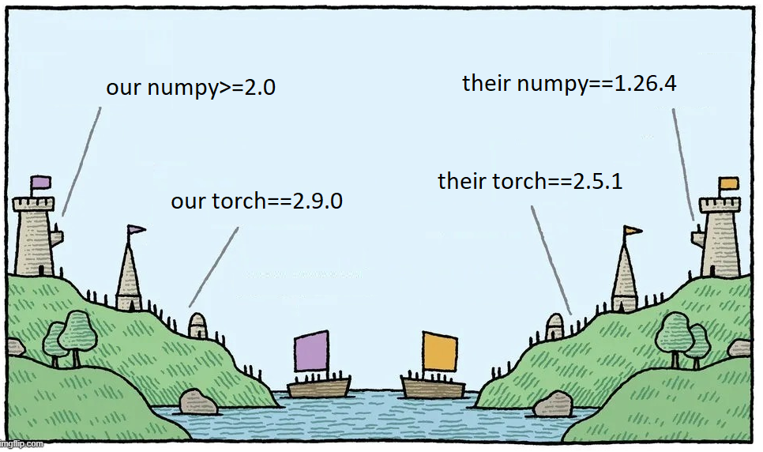

Installation
###################

.. admonition:: Note

    We recommend to use **UV** since it is much faster and takes less disk space.
    
    To use UV, install it with :code:`wget -qO- https://astral.sh/uv/install.sh | sh`.

Typical installation
------------------------

Supports many models, datasets and web dashboard:

.. tab-set::

    .. tab-item:: Pip

        .. code-block:: bash

            sudo apt install python3-dev python3.12-dev python3.12-venv ffmpeg
            pip install asr_eval[all]

    .. tab-item:: UV

        .. code-block:: bash

            sudo apt install python3-dev python3.12-dev python3.12-venv ffmpeg
            uv pip install asr_eval[all]

Let's validate the installation by running model inference and a web dashboard:

.. code-block:: bash

    python -m asr_eval.bench.run -s whisper-predictions \
         -p whisper-tiny -d fleurs-ru:n=5
    python -m asr_eval.bench.dashboard.run -s whisper-predictions

Lightweight installation
------------------------

Some models bring heavy dependencies. You
can make installation lighter and/or resolve conflicts with your environment
by removing optional components. Please refer to the :code:`pyproject.toml`,
read the commentaries and install only the required extras.

.. tab-set::

    .. tab-item:: Pip

        .. code-block:: bash

            # example: support the dataset loading and dashboard,
            # but no model support (so, no torch dependency etc.)
            pip install asr_eval[datasets,dash]

    .. tab-item:: UV

        .. code-block:: bash

            # example: support the dataset loading and dashboard,
            # but no model support (so, no torch dependency etc.)
            uv pip install asr_eval[datasets,dash]

Model installations
------------------------

Some ASR models have conflicting dependencies! This is
inevitable in large model collections. For this reason we do not include some models
into the *asr_eval* dependencies. See below for installation instructions for specific models.

Dev installation
------------------------

For contributing and to type-check the whole project,
please install as follows.

.. tab-set::

    .. tab-item:: Pip

        .. code-block:: bash

            git clone https://github.com/SibNN/asr_eval
            cd asr_eval

            python3.12 -m venv venv
            source venv/bin/activate

            pip install .[all,dev]
            pip install -r requirements/type_checking.txt --no-dependencies

            # then you can run tests and type checking:
            python -m pytest tests
            python -m xdoctest asr_eval --verbose 1
            python -m pyright -p pyrightconfig.json asr_eval

    .. tab-item:: UV

        .. code-block:: bash

            git clone https://github.com/SibNN/asr_eval
            cd asr_eval

            uv sync --extra all --extra dev
            uv pip install -r requirements/type_checking.txt --no-deps

            # then you can run tests and type checking:
            uv run python -m pytest tests
            uv run python -m xdoctest asr_eval --verbose 1
            uv run python -m pyright -p pyrightconfig.json asr_eval

The file :code:`type_checking.txt` contains all optional packages without dependencies,
so no dependency conflicts will occur and type checking will succeed. This
can be combined with model installation (see below).

.. _Model installations:

List of model installations
-----------------------------

A model installation is a set of addidional requirements to make certain models
and pipelines work. It is not possible to install all the models at once, because
some of them have incompatible dependencies. It is recommended to create a separate
venvs for different installations.

Whisper, Wav2vec2, Vikhr Borealis
======================================

.. tab-set::

    .. tab-item:: Pip

        .. code-block:: bash

            # install
            pip install asr_eval[models_stable,datasets]

            # check
            python -m asr_eval.bench.check whisper-tiny --audio EN_LONG
            python -m asr_eval.bench.check wav2vec2-large-960h --audio EN_LONG
            python -m asr_eval.bench.check vikhr-borealis-vad --audio RU_LONG

    .. tab-item:: UV

        .. code-block:: bash

            # install
            uv pip install asr_eval[models_stable,datasets]

            # check
            uv run python -m asr_eval.bench.check whisper-tiny --audio EN_LONG
            uv run python -m asr_eval.bench.check wav2vec2-large-960h --audio EN_LONG
            uv run python -m asr_eval.bench.check vikhr-borealis-vad --audio RU_LONG

Wav2vec2 with KenLM
======================================

.. tab-set::

    .. tab-item:: Pip

        .. code-block:: bash

            # install
            pip install asr_eval[models_stable,datasets,kenlm]
            pip install pyctcdecode==0.5.0 --no-dependencies

            # check
            python -m asr_eval.bench.check wav2vec2-large-ru-golos-lm-t-one --audio RU_LONG

    .. tab-item:: UV

        .. code-block:: bash

            # install
            uv pip install asr_eval[models_stable,datasets,kenlm]
            uv pip install pyctcdecode==0.5.0 --no-deps

            # check
            uv run python -m asr_eval.bench.check wav2vec2-large-ru-golos-lm-t-one --audio RU_LONG

Voxtral via VLLM
======================================

.. tab-set::

    .. tab-item:: Pip

        .. code-block:: bash

            # install
            pip install asr_eval[models_stable,datasets,openai]

            # check
            python -m asr_eval.bench.check voxtral-3B

    .. tab-item:: UV

        .. code-block:: bash

            # install
            uv pip install asr_eval[models_stable,datasets,openai]

            # check
            uv run python -m asr_eval.bench.check voxtral-3B

Nemo
======================================

.. tab-set::

    .. tab-item:: Pip

        .. code-block:: bash

            # install
            pip install asr_eval[models_stable,datasets,nemo]

            # check
            python -m asr_eval.bench.check parakeet-tdt-0.6b-v3-vad --audio EN_LONG

    .. tab-item:: UV

        .. code-block:: bash

            # install
            uv pip install asr_eval[models_stable,datasets,nemo]

            # check
            uv run python -m asr_eval.bench.check parakeet-tdt-0.6b-v3-vad --audio EN_LONG

Speechbrain
======================================

.. tab-set::

    .. tab-item:: Pip

        .. code-block:: bash

            # install
            pip install asr_eval[models_stable,datasets]
            pip install speechbrain "huggingface_hub<1"

            # check
            python -m asr_eval.bench.check speechbrain-conformer-gigaspeech-streaming

    .. tab-item:: UV

        .. code-block:: bash

            # install
            uv pip install asr_eval[models_stable,datasets]
            uv pip install speechbrain "huggingface_hub<1"

            # check
            uv run python -m asr_eval.bench.check speechbrain-conformer-gigaspeech-streaming

Gemma3n
======================================

.. tab-set::

    .. tab-item:: Pip

        .. code-block:: bash

            # install
            pip install asr_eval[models_stable,datasets]
            pip install -r requirements/gemma3n.txt  # from asr_eval repo

            # check
           python -m asr_eval.bench.check gemma3n-vad

    .. tab-item:: UV

        .. code-block:: bash

            # install
            uv pip install asr_eval[models_stable,datasets]
            uv pip install -r requirements/gemma3n.txt  # from asr_eval repo

            # check
            uv run python -m asr_eval.bench.check gemma3n-vad

Qwen2-Audio
======================================

Currently produces bad output, TODO fix the prompt or the code.

.. tab-set::

    .. tab-item:: Pip

        .. code-block:: bash

            # install
            pip install asr_eval[models_stable,datasets,qwen2audio]
            pip install flash-attn --no-build-isolation

            # check
            python -m asr_eval.bench.check qwen2-audio-vad

    .. tab-item:: UV

        .. code-block:: bash

            # install
            uv pip install asr_eval[models_stable,datasets,qwen2audio]
            uv pip install flash-attn --no-build-isolation

            # check
            uv run python -m asr_eval.bench.check qwen2-audio-vad

Faster-Whisper
======================================

.. tab-set::

    .. tab-item:: Pip

        .. code-block:: bash

            # install
            pip install asr_eval[models_stable,datasets]
            pip install faster_whisper

            # check
            python -m asr_eval.bench.check faster-whisper-internal-vad --audio EN_LONG

    .. tab-item:: UV

        .. code-block:: bash

            # install
            uv pip install asr_eval[models_stable,datasets]
            uv pip install faster_whisper

            # check
            uv run python -m asr_eval.bench.check faster-whisper-internal-vad --audio EN_LONG

If it says "Unable to load any of {libcudnn_ops.so.9.1.0, ...}" - then find this file:

.. code-block:: bash
    
    sudo find . -name "libcudnn_ops.so*" 2>/dev/null

And add the directory containing this file to :code:`LD_LIBRARY_PATH`, for example:

.. code-block:: bash
    
    export LD_LIBRARY_PATH=$LD_LIBRARY_PATH:..../lib/python3.12/site-packages/nvidia/cudnn/lib

GigaAM with KenLM (ru only)
======================================

.. tab-set::

    .. tab-item:: Pip

        .. code-block:: bash

            # install
            pip install asr_eval[models_stable,datasets,kenlm]
            pip install git+https://github.com/salute-developers/GigaAM
            pip install pyctcdecode==0.5.0 --no-dependencies

            # check
            python -m asr_eval.bench.check gigaam3-rnnt-vad --audio RU_LONG
            python -m asr_eval.bench.check gigaam2-ctc-lm-t-one --audio RU_LONG

    .. tab-item:: UV

        .. code-block:: bash

            # install
            uv pip install asr_eval[models_stable,datasets,kenlm]
            uv pip install git+https://github.com/salute-developers/GigaAM
            uv pip install pyctcdecode==0.5.0 --no-deps

            # check
            uv run python -m asr_eval.bench.check gigaam3-rnnt-vad --audio RU_LONG
            uv run python -m asr_eval.bench.check gigaam2-ctc-lm-t-one --audio RU_LONG

Vosk (ru only)
======================================

.. tab-set::

    .. tab-item:: Pip

        .. code-block:: bash

            # install
            sudo apt install cmake -y
            pip install asr_eval[datasets]
            pip install -r requirements/vosk.txt  # from asr_eval repo

            # check
            python -m asr_eval.bench.check vosk-0.54-vad --audio RU_LONG
            python -m asr_eval.bench.check vosk-ru-0.42-streaming --audio RU

    .. tab-item:: UV

        .. code-block:: bash

            # install
            sudo apt install cmake -y
            uv pip install asr_eval[datasets]
            uv pip install -r requirements/vosk.txt  # from asr_eval repo

            # check
            uv run python -m asr_eval.bench.check vosk-0.54-vad --audio RU_LONG
            uv run python -m asr_eval.bench.check vosk-ru-0.42-streaming --audio RU

.. _t_one_installation:

T-One (ru only)
======================================

T-One depends on pyctcdecode, and pyctcdecode (PyPI version) depends on numpy 1.x.
This is too restrictive, given that pyctcdecode also works perfectly for numpy 2.x.
To address this, we first install T-One and pyctcdecode without dependencies,
and then install dependencies manually.

.. tab-set::

    .. tab-item:: Pip

        .. code-block:: bash

            # install
            pip install asr_eval[models_stable,datasets,kenlm]
            pip install pyctcdecode==0.5.0 --no-dependencies
            pip install git+https://github.com/voicekit-team/T-one --no-dependencies
            pip install "huggingface-hub (>=0.14,<1)" "onnxruntime (>=1.12,<2)"

            # check
            python -m asr_eval.bench.check t-one-vad --audio RU_LONG

    .. tab-item:: UV

        .. code-block:: bash

            # install
            uv pip install asr_eval[models_stable,datasets,kenlm]
            uv pip install pyctcdecode==0.5.0 --no-deps
            uv pip install git+https://github.com/voicekit-team/T-one --no-deps
            uv pip install "huggingface-hub (>=0.14,<1)" "onnxruntime (>=1.12,<2)"

            # check
            uv run python -m asr_eval.bench.check t-one-vad --audio RU_LONG

Yandex-speechkit API
======================================

.. tab-set::

    .. tab-item:: Pip

        .. code-block:: bash

            # install
            pip install asr_eval[datasets]
            pip install yandex-speechkit

            # check
           python -m asr_eval.bench.check yandex-speechkit --audio EN_LONG

    .. tab-item:: UV

        .. code-block:: bash

            # install
            uv pip install asr_eval[datasets]
            uv pip install yandex-speechkit

            # check
            uv run python -m asr_eval.bench.check yandex-speechkit --audio EN_LONG

Salute API
======================================

.. tab-set::

    .. tab-item:: Pip

        .. code-block:: bash

            # install
            pip install asr_eval[datasets]
            pip install salute_speech

            # check
            python -m asr_eval.bench.check salute-api-en --audio EN_LONG

    .. tab-item:: UV

        .. code-block:: bash

            # install
            uv pip install asr_eval[datasets]
            uv pip install salute_speech

            # check
            uv run python -m asr_eval.bench.check salute-api-en --audio EN_LONG