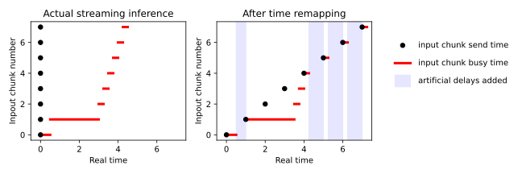
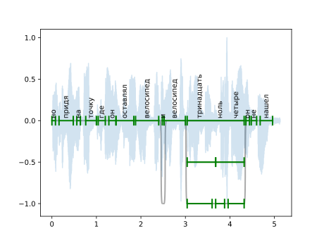
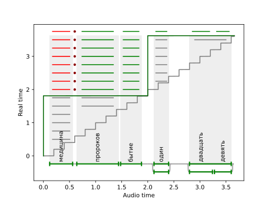
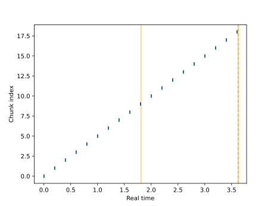
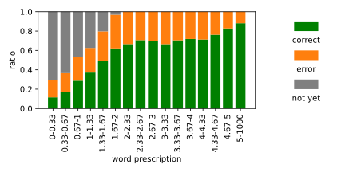
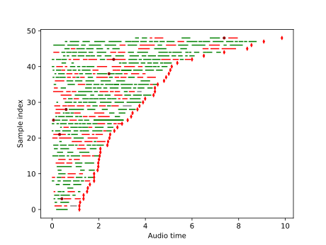

Streaming evaluation
#############################

Streaming speech recognition system can be evaluated by a variety of parameters:

1. Final WER/CER.
2. Latency induced by calculations.
3. Latency induced by accumulating context, where the model refuses to emit a word
   until accumulates enough audio frames, even with infinite compute speed.
4. The dependency between average WER and time delta, if the system is able to
   correct previous transcription as more audio context comes.
5. Distributions, spikes and edge cases of the parameters described above.

In view of the diversity of all the streaming characteristics,
we believe that diagramming is a good way to analyze a
streaming system.

StreamingASR interface
===========================

First, to unify evaluation,
we define a general input-output interface: the system accepts audio chunks labeled
by recording ID via input buffer, and emits strings labeled by recording ID and part
ID. When a new string is emitted, if the part ID matches that for one of the previous
parts, it replaces that part, otherwise the new string appended to the end of the
text. This allows a system to correct previously emitted words or sentences, if needed.
For the described interface, we develop a wrapper
:class:`~asr_eval.streaming.model.StreamingASR` with input and output buffers, which
makes it easy to wrap any streaming ASR into our interface.

Time remapping
===========================

To simulate real-time CPU/GPU loading (and thus a realistic latency) we need to send
audio in real time. However, this leads to time spans when both the sender and the
system waits, because the system had processed all the previous chunks, but the time
to send the next chunk has not yet come. To speed up simulated evaluations, we may
wish to eliminate these spans. To this end, we develop an algorithm called time
remapping: we send all the input chunks at once, process them, and during evaluation we
add artificial time spans to accurately simulate real-time sending. This process can be
understood from the figure below. This is, however, limited to single-threaded systems.

Word-level timings
===========================

First, we perform CTC force alignment to determine time span for each word.
While CTC loss does not enforce correct positioning, we observe that such a pseudo-labeling
is precise enough: an error is usually less than 0.2 seconds and rarely exceeds 0.5 seconds.
For multi-reference blocks, we need at least one option that can be encoded into model's
vocabilary. We perform forced alignment on this option and propagate timings to another options.
This is done automatically in :func:`~asr_eval.align.timings.fill_word_timings_inplace`.

.. admonition:: Installation

    For this guide, we need a support for ASR models and datasets. Please
    install the required packages:

    :code:`pip install asr_eval[datasets] "torch==2.8.*" "torchaudio==2.8.*" torchcodec==0.7 transformers`
    
    Refer to the :doc:`guide_installation` for more ASR models.

In this guide we use "sova-rudevices-multivariant" Russian dataset and GigaAM-v3 model
to extract word-level timings.

.. testcode::

    from datasets import Dataset
    import matplotlib.pyplot as plt
    import numpy as np
    from asr_eval.align.parsing import DEFAULT_PARSER
    from asr_eval.align.plots import draw_timed_transcription
    from asr_eval.align.timings import fill_word_timings_inplace
    from asr_eval.bench.datasets import AudioSample
    from asr_eval.bench.datasets import get_dataset
    from asr_eval.models.gigaam_wrapper import GigaAMShortformCTC

    gigaam = GigaAMShortformCTC('v2')
    dataset: Dataset = get_dataset('sova-rudevices-multivariant')

    sample: AudioSample = dataset[46]
    transcription = DEFAULT_PARSER.parse_transcription(sample['transcription'])
    waveform = sample['audio']['array']
    waveform /= waveform.max()
    fill_word_timings_inplace(gigaam, waveform, transcription)

    plt.plot(np.arange(len(waveform)) / 16_000, waveform, alpha=0.2)
    draw_timed_transcription(transcription)

Transcribing and evaluating
=================================

In the code below, we send input chunks, receive the full transcription and evaluate
it against the ground truth. In this guide we use a simple pseudo-streaming wrappe
that calls a wav2vec model every 2 seconds. Alternatively, you can use a real streaming
model T-One (uncomment it in the code below, see the installation guide in
:ref:`t_one_installation`).

.. testcode::

    from typing import cast
    from tqdm.auto import tqdm
    from asr_eval.align.timings import CannotFillTimings
    from asr_eval.streaming.wrappers import OfflineToStreaming
    from asr_eval.models.wav2vec2_wrapper import Wav2vec2Wrapper
    from asr_eval.utils.types import FLOATS
    from asr_eval.streaming.evaluation import StreamingEvaluationResults
    from asr_eval.streaming.evaluation import remap_time, make_sender
    from asr_eval.streaming.caller import receive_transcription
    from asr_eval.streaming.evaluation import evaluate_streaming

    # a simple pseudo-streaming wrapper
    wrapper = OfflineToStreaming(
        Wav2vec2Wrapper('jonatasgrosman/wav2vec2-large-xlsr-53-russian'),
        interval=2,
    )

    # or a real streaming model
    # from asr_eval.models.t_one_wrapper import TOneStreaming
    # wrapper = TOneStreaming()

    wrapper.start_thread();

    def do_eval(
        waveform: FLOATS,  
        text: str,
        do_remap_time: bool = True,
    ) -> StreamingEvaluationResults:
        # `waveform` is a float array in rate 16_000,
        # such as `librosa.load(file, sr=16000)[0]`
        # `text` can possibly contain multi-reference syntax
        transcription = DEFAULT_PARSER.parse_transcription(text)
        fill_word_timings_inplace(gigaam, waveform, transcription)

        cutoffs, sender = make_sender(waveform, wrapper)
        sender.start_sending(without_delays=do_remap_time)
        output_chunks = list(receive_transcription(
            asr=wrapper, id=sender.id
        ))
        input_chunks = sender.join_and_get_history()
        if do_remap_time:
            input_chunks, output_chunks = remap_time(
                cutoffs, input_chunks, output_chunks
            )

        return evaluate_streaming(
            transcription, waveform, cutoffs, input_chunks, output_chunks
        )

    N_SAMPLES = 50  # reduce this to take less samples from the dataset

    if len(dataset) > N_SAMPLES:
        dataset = dataset.take(N_SAMPLES)

    evals: list[StreamingEvaluationResults] = []
    for i in tqdm(range(len(dataset))):
        sample = cast(AudioSample, dataset[i])
        try:
            eval = do_eval(sample['audio']['array'], sample['transcription'])
            evals.append(eval)
        except CannotFillTimings:
            # cannot fill timings if the GigaAM CTC vocabulary is not enough
            # so we skip this sample
            continue

In the code above, we use helper functions
:func:`~asr_eval.streaming.evaluation.make_sender`,
:func:`~asr_eval.streaming.evaluation.receive_transcription`
and :func:`~asr_eval.streaming.evaluation.evaluate_streaming`.
You can check their docstrings and code to understand what happens on the lower level.

The resulting :code:`evals` is a list of
:class:`~asr_eval.streaming.evalution.StreamingEvaluationResults`,
where the most important field is 
:attr:`~asr_eval.streaming.evalution.StreamingEvaluationResults.partial_alignments`.
Each partial alignment is a state at a certain point in time. It keeps 3 time points:

- :code:`at_time`. A real time of interest.
- :code:`audio_seconds_sent`. Audio seconds sent into the model: end time of the last input chunk sent before :code:`at_time`.
- :code:`audio_seconds_processed`. Audio seconds processed. The model returns this value with each output chunk, and we take the value from the last output chunk received before :code:`at_time`.

For each partial alignment, the prediction is a union of all output chunks received
before :code:`at_time`. We take the beginning of the true transcription until
:code:`audio_seconds_sent` and align it with the prediction. This works also for
multivariant transcriptions. If :code:`audio_seconds_processed` is in the middle
of a word, we consider two options with and without this word, and select one with
the lowest word error count.

The :code:`partial_alignment.get_error_positions()` function returns a list of
:class:`~asr_eval.streaming.evaluation.StreamingASRErrorPosition`. Its
:attr:`~asr_eval.streaming.evaluation.StreamingASRErrorPosition.status` field can be one of:

.. list-table::
   :header-rows: 1

   * - Status
     - Description
     - Color in the diagram
   * - **correct**
     - A correctly transcribed word, *including* matches with wildcard symbol.
     - green
   * - **replacement**
     - An incorrectly transcribed single word.
     - red
   * - **insertion**
     - A transcribed word that was not spoken.
     - dark-red dot
   * - **deletion**
     - A missed word that was spoken but was not transcribed.
     - gray
   * - **not_yet**
     - Trailing deletions in the end of the alignment.
     - gray

As you can see, this is roughly the same error types as in non-streaming case, but if we found a tail of deletions, we assign "not yet" status to them. In this way we can distinguish between skipped and not yet transcribed words.

We can visualize all the error positions, sent and processed times on a diagram. Sent
audio seconds are displayed with the gray line, processed audio seconds are displayed
with the dark green line. Replacements are shown in red, deletions in gray, insertions
as dark-red dots, and correct matches are shown in green.

.. testcode::

    from matplotlib import pyplot as plt
    from asr_eval.streaming.plots import partial_alignments_plot
    partial_alignments_plot(evals[12])

From the diagram we can make valuable observations about the model performance and quality.
It allows to spot lags at some chunks, missing words and more problems.

.. admonition:: On partial alignment end time

    Currently, we align against the annotation up to :code:`audio_seconds_sent`. This may
    cause artifacts where a word spoken after :code:`audio_seconds_processed` is treated
    as replacement (not a deletion as it should be). Ideally, we should align against
    :code:`audio_seconds_processed` and tread all the words between :code:`audio_seconds_processed`
    and :code:`audio_seconds_sent` as "not yet transcribed". This is not implemented yet,
    since is not trivial for multi-reference annotation, but we are working on it.

We can print all the error positions as follows:

.. testcode::

    for partial_alignment in evals[12].partial_alignments:
        print([pos.status for pos in partial_alignment.get_error_positions()])

.. testoutput::

    []
    []
    ['not_yet']
    ['not_yet']
    ['not_yet']
    ['not_yet']
    ['not_yet', 'not_yet']
    ['not_yet', 'not_yet']
    ['replacement', 'insertion', 'correct', 'correct']
    ['replacement', 'insertion', 'correct', 'correct', 'not_yet']
    ['replacement', 'insertion', 'correct', 'correct', 'not_yet']
    ['replacement', 'insertion', 'correct', 'correct', 'not_yet']
    ['replacement', 'insertion', 'correct', 'correct', 'not_yet']
    ['replacement', 'insertion', 'correct', 'correct', 'not_yet']
    ['replacement', 'insertion', 'correct', 'correct', 'not_yet', 'not_yet']
    ['replacement', 'insertion', 'correct', 'correct', 'correct', 'correct', 'correct']

We can also visualize input and output chunks timings.

.. testcode::

    from asr_eval.streaming.plots import visualize_history
    visualize_history(evals[12].input_chunks, evals[12].output_chunks)

In the chunk history diagram, X axis is a real time
(in contrast to the previous diagram), and for each input chunk put timestamp is marked
in green (the moment when the sender sent the chunk to the buffer), and get timestamp
is marked in blue (the moment when the StreamingASR thread takes this chunk from the
buffer). As we don't see blue marks, get timestamp nearly equals put timestamp for all input
chunks. If the model processes chunks sequentially, a lag between put ang get time would
indicate that processing the previous chunk took a long time. Orange lines show times
when output chunks are emitted.

Aggregating the evaluations
=================================

To aggregate metrics for multiple samples, we propose a streaming histogram.
We first take each word for each
partial alignment and for each sample. For each word, we
calculate prescription ("how long ago was the word spoken") - the difference between the word timing (center time)
and the length of the audio sent at time of the current partial alignment. Also, we categorize each word into one of
3 types:

.. list-table::
   :header-rows: 1

   * - Type
     - Color in the diagram
   * - Correct
     - green
   * - Error (replacement, insertion or deletion), excluding not yet transcribed tail
     - orange
   * - Not yet transcribed
     - gray

So, for each word we define prescription and
one of 3 types. This is enough to make a histogram. We divide prescription into bins (X axis), and for each
bin we count the ratio of all types: correct (green), errors (orange) and not yet transcribed (gray). This provides insights
into system’s latency and quality.

.. testcode::

    import matplotlib.patches as patches
    from asr_eval.streaming.plots import streaming_error_vs_latency_histogram

    fig, axs = plt.subplots(ncols=2, figsize=(4, 3), gridspec_kw={'width_ratios': [3, 1]})

    streaming_error_vs_latency_histogram(evals, max_latency=5, ax=axs[0])

Finally, let us visualize the last partial alignments for all samples. The
last partial alignment is actually the full alignment when transcribing is finished.

.. testcode::

    from asr_eval.streaming.plots import show_last_alignments

    show_last_alignments(evals)

