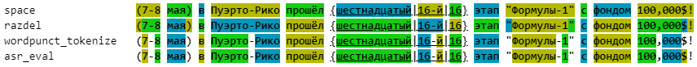
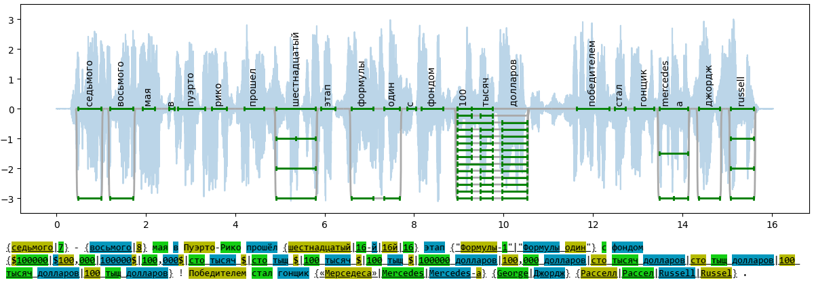
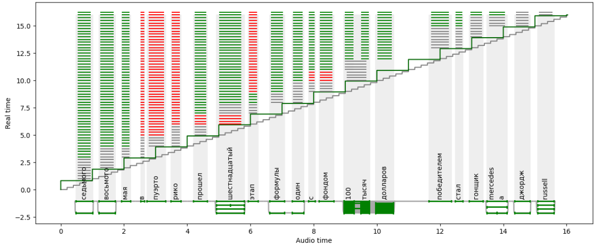
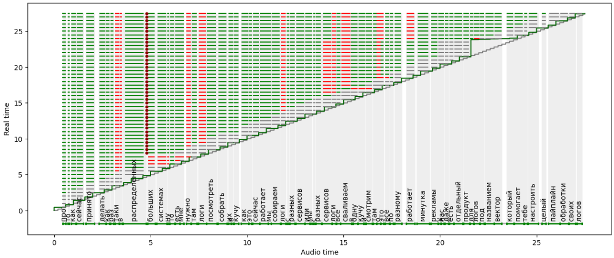
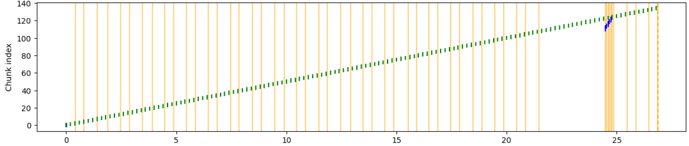
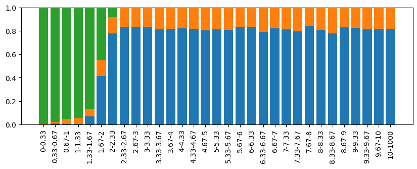
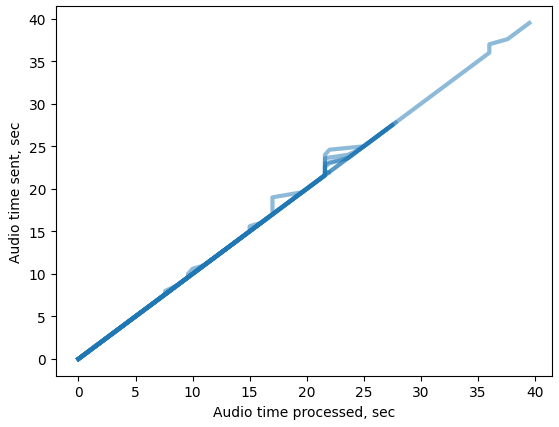
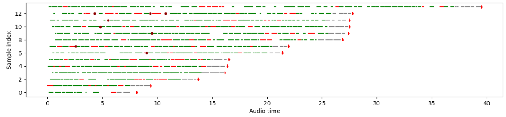

Streaming pipeline
##############################

On this page we will go through all stages of the streaming evaluation pipeline, from preparing time labeled data to diagramming.

The code below is from the `notebooks/Demo.ipynb` notebook.

.. raw:: html

   

   
<a>The required imports</a>

.. code-block:: python

    import typing
    from pathlib import Path

    import librosa
    from datasets import load_dataset, Audio
    import gigaam
    from gigaam.model import GigaAMASR
    import numpy as np
    import numpy.typing as npt
    import matplotlib.pyplot as plt

    from asr_eval.datasets.recording import Recording
    from asr_eval.align.data import MatchesList
    from asr_eval.align.timings import fill_word_timings_inplace, CannotFillTimings
    from asr_eval.align.parsing import parse_multivariant_string, colorize_parsed_string
    from asr_eval.align.plots import draw_timed_transcription
    from asr_eval.streaming.models.vosk import VoskStreaming
    from asr_eval.streaming.evaluation import default_evaluation_pipeline
    from asr_eval.streaming.model import TranscriptionChunk
    from asr_eval.streaming.evaluation import RecordingStreamingEvaluation
    from asr_eval.align.recursive import align
    from asr_eval.streaming.plots import (
        partial_alignments_plot,
        visualize_history,
        streaming_error_vs_latency_histogram,
        latency_plot,
        show_last_alignments,
    )

.. raw:: html

   

Multivariant format
**************************************

In `asr_eval`, a transcription may contain zero or more of the following elements:

1. **Multivariant blocks** in braces, where options are separated by vertical line "|". If there is only a single option in braces, empty substring is added as the other option: *{oh}* equals *{oh|}*, but *{oh|uh}* does not equal *{oh|uh|}*. Currently, no nested braces are allowed.

2. **"Anything" blocks**, typed as `<*>`, that match any sequence of words, possibly empty. These blocks however do not increase the counter of the correctly transcribed words. They represent our refusal to evaluate a certain segment.

An example: *{Okay|okey|ok} {Okay|okey|ok|} I give {one dollar|1 dollar|1$|$1}*.

Here a person speaks "okay" twice, but some models such as Whisper may omit the second word, as people transcribers would do, and we may not want to consider it a mistake.

Tokenizing transcriptions
*******************************

When annotating a dataset, we should be aware of the tokenization used. For example, if "1$" is tokenized as a single word, then we should extend our multivariant block to contain both "1$" and  "1 $" (with space). Based on this, we can formulate requirements for tokenization rules:

1. Make it simpler so as not to confuse annotators.
2. Tokenize in a way that reduces number of variants in multivariant blocks.
3. Make it complementary with the subsequent stage of punctuation removal.

A well-known :code:`nltk.wordpunct_tokenize` algorithm searches for either :code:`\\w+` or :code:`[^\\w\\s]+` matches. This does not allow to separate symbols such as dollar sign from punctuation: *"$!"* will be considered a single token.

**Our algorithm**

We treat the following symbols as a punctuation :code:`{P} = .,!?:;…-–—'"‘“”«»()[]{}` and search one of the following patterns:

1. :code:`\\w+` (a sequence of word symbols: letters and digits)
2. :code:`[^\\w\\s{P}]+` (a sequence of other symbols, excluding spaces)
3. :code:`[{P}]+` (a sequence of punctuation symbols)

The first two patterns are considered words.

Our :code:`parse_multivariant_string` function supports 4 methods: ours ("asr_eval"), "wordpunct_tokenize", "space" (searching for :code:`\S+`) and "`razdel`_" (a library for Russian word tokenization). Based on the arguments above, we set "asr_eval" as a default method. The function also applies postprocessing (enabled by default, can be disabled):

.. _razdel: https://github.com/natasha/razdel

1. Drops punctiation words (`[{P}]+`).
2. Turns into lower case.
3. Converts Russian "ё" into "е".

We keep the positions of each word in the original text. In the example below, words are stored as lower case, but spans are visualized in the original text and thus may be in upper case. Token colors have no meaning and are just to visually separate them.

.. code-block:: python

    text = (
        '(7-8 мая) в Пуэрто-Рико прошёл {шестнадцатый|16-й|16}'
        ' этап "Формулы-1" с фондом 100,000$!'
    )

    for method in 'space', 'razdel', 'wordpunct_tokenize', 'asr_eval':
        tokens = parse_multivariant_string(text, method=method)
        colored_str, colors = colorize_parsed_string(text, tokens)
        print(f'{method: <20}', colored_str)

Obtaining timed transcriptions
************************************

We use CTC force alignment to determine time span for each symbol. While CTC loss does not enforce correct positioning, we notice that such a pseuco-labeling is precise enough: an error is usually less than 0.2 seconds and rarely exceeds 0.5 seconds.

For multivariant blocks, we need at least one option that can be encoded into model's token ID. For example, Russian GigaAM 2 model has a vocabulary of russian letters only, and in a block "{Facebook|Фейсбук}" only the last option can be encoded. If several options can be encoded, we select the longest one, for example in "{milliseconds|ms}" we select the first option. After selecting one option in each block, we can perform force alignment. If this is not possible (very rare cases), and we throw an exception.

After obtaining timings for one option for a multivariant block, we can propagate timings into the other options. Each option is a list of words. Let we have two options :code:`A = X + A1 + Y` (timed) and :code:`B = X + B1 + Y`, where some lists may be empty. Let either :code:`len(A) == 1 and len(B) >= 1` or :code:`len(A) >= 1 and len(B) == 1`. In these cases we can assign timings for :code:`B` given timings for :code:`A`.

The function `fill_word_timings_inplace` accepts CTC model, waveform, a tokenized transcription (possibly multivariant) and performs force alignments with filling :code:`.start_time` and :code:`.end_time` for each word. Set :code:`verbose=True` to see the process of timing propagation.

.. code-block:: python

    waveform: npt.NDArray[np.floating] = (
        librosa.load('tests/testdata/formula1.mp3', sr=16000)[0])
    waveform += waveform[::-1] / 4  # add some speech-like noise

    text = Path('tests/testdata/formula1.txt').read_text()
    tokens = parse_multivariant_string(text)

    model = typing.cast(GigaAMASR, gigaam.load_model('ctc', device='cuda'))
    fill_word_timings_inplace(model, waveform, tokens, verbose=True)

Output:

.. code-block::

    Propagated timings from [седьмого (0.5-1.0)] to [7 (0.5-1.0)]
    Propagated timings from [восьмого (1.2-1.7)] to [8 (1.2-1.7)]
    Propagated timings from [шестнадцатый (4.9-5.8)] to [16й (4.9-5.8)]
    Propagated timings from [шестнадцатый (4.9-5.8)] to [16 (4.9-5.8)]
    Propagated timings from [шестнадцатый (4.9-5.8)] to [16 (4.9-5.4), й (5.4-5.8)]
    Propagated timings from [формулы (6.6-7.1), один (7.3-7.7)] to [формулы (6.6-7.1), 1 (7.3-7.7)]
    Propagated timings from [сто (9.0-9.3), тысяч (9.5-9.8), долларов (10.0-10.5)] to [100 (9.0-9.3), тысяч (9.5-9.8), долларов (10.0-10.5)]
    Propagated timings from [100 (9.0-9.3), тысяч (9.5-9.8), долларов (10.0-10.5)] to [100 (9.0-9.3), тыщ (9.5-9.8), долларов (10.0-10.5)]
    Propagated timings from [100 (9.0-9.3), тысяч (9.5-9.8), долларов (10.0-10.5)] to [100 (9.0-9.3), 000 (9.5-9.8), долларов (10.0-10.5)]
    ...

We can visualize the result and the waveform:

.. code-block:: python

    plt.figure(figsize=(15, 4))
    plt.plot(np.arange(len(waveform)) / 16000,
        3 * waveform / waveform.max(), alpha=0.3, zorder=-1)
    draw_timed_transcription(tokens, y_delta=-3)
    plt.ylim(-3.5, 3.5)
    plt.show()

    print(colorize_parsed_string(text, tokens)[0])

Note that having 14 options in a multivariant block is a very rare situation, most cases are much simpler.

Streaming model
**************************

We provide a detailed docstring in the `StreamingASR` class. The main features are described in the overview section :ref:`Preparing streaming models`. For know it is important that a streaming model accepts waveform chunks and returns transcription chunks (adding more words or editing previous words), and they are not always related one to one.

Streaming evaluation
**************************

A :code:`default_evaluation_pipeline` function starts sending input chunks, receives the full transcription and evaluates it against the ground truth. To customize, you can copy and edit the function contents.

.. code-block:: python

    asr = VoskStreaming(model_name='vosk-model-ru-0.42', chunk_length_sec=1)
    asr.start_thread()

    recording = Recording(
        transcription=text,
        transcription_words=tokens,
        waveform=waveform,
    )
    eval = default_evaluation_pipeline(recording, asr)

    asr.stop_thread()

The result :code:`eval.partial_alignments: list[PartialAlignment]` is the main concept in the streaming evaluation pipeline. Each partial alignment is a state at a certain point in time. It keeps 3 time points:

- :code:`at_time`. A real time of interest.
- :code:`audio_seconds_sent`. Audio seconds sent into the model: end time of the last input chunk sent before `at_time`.
- :code:`audio_seconds_processed`. Audio seconds processed. The model returns this value with each output chunk, and we take the value from the last output chunk received before `at_time`.

For each partial alignment, the prediction is a union of all output chunks received before `at_time`, and the field `.pred` contains a tokenized version of the transcription.

.. code-block:: python

    print(TranscriptionChunk.join(eval.output_chunks))
    print(eval.partial_alignments[-1].pred)

Output:

.. code-block::

    седьмого восьмого мая по эру дарика прошёл шестнадцатый этаж формулы один с фондом сто тысяч долларов победителем стал гонщик мерседеса
    [Token(седьмого), Token(восьмого), Token(мая), Token(по), Token(эру), Token(дарика), Token(прошел),
    Token(шестнадцатый), Token(этаж), Token(формулы), Token(один), Token(с), Token(фондом), Token(сто),
    Token(тысяч), Token(долларов), Token(победителем), Token(стал), Token(гонщик), Token(мерседеса)]

For each partial alignment, we take the beginning of the true transcription until :code:`audio_seconds_processed` and align it with the prediction. This works also for multivariant transcriptions. If :code:`audio_seconds_processed` is in the middle of a word, we consider two options with and without this word, and select one with the lowest word error count. :code:`PartialAlignment.alignment.matches` contains a list of :code:`Match`, where each match has one of the following statuses: "correct", "deletion", "insertion", or "replacement".

.. code-block:: python

    eval.partial_alignments[-1].alignment.matches

Output:

.. code-block::

    [Match(Token(седьмого, t=(0.5, 1.0)), Token(седьмого)),
    Match(Token(восьмого, t=(1.2, 1.7)), Token(восьмого)),
    Match(Token(мая, t=(1.9, 2.2)), Token(мая)),
    Match(Token(в, t=(2.5, 2.6)), Token(по)),
    Match(Token(пуэрто, t=(2.7, 3.3)), Token(эру)),
    Match(Token(рико, t=(3.5, 3.8)), Token(дарика)),
    ...

Each :code:`Match` can be converted into a :code:`StreamingASRErrorPosition`. It is similar to match, but:

1. Always keeps an audio timings to display. In :code:`Match`, for "insertion" we have no timings, which is obvious. When converting to :code:`StreamingASRErrorPosition`, we assign a timing between neighbour words, just to be able to visualize.

2. Can have a status "not_yet": which is assigned if a Match is a "deletion", and all subsequent matches until :code:`audio_seconds_processed` are "deletion". In this way we can distinguish between missing and not yet transcribed words.

.. code-block:: python

    eval.partial_alignments[-1].get_error_positions()

Output:

.. code-block::

    [StreamingASRErrorPosition(start_time=0.48, end_time=1.0, processed_time=16.031375, status='correct'),
    StreamingASRErrorPosition(start_time=1.2, end_time=1.72, processed_time=16.031375, status='correct'),
    StreamingASRErrorPosition(start_time=1.92, end_time=2.2, processed_time=16.031375, status='correct'),
    StreamingASRErrorPosition(start_time=2.52, end_time=2.64, processed_time=16.031375, status='replacement'),
    ...
    StreamingASRErrorPosition(start_time=13.48, end_time=14.12, processed_time=16.031375, status='correct'),
    StreamingASRErrorPosition(start_time=14.36, end_time=14.84, processed_time=16.031375, status='not_yet'),
    StreamingASRErrorPosition(start_time=15.08, end_time=15.6, processed_time=16.031375, status='not_yet')]

We can visualize all the error positions, sent and processed times on a diagram. Sent audio seconds are displayed with the gray line, processed audio seconds are displayed with the dark green line. Replacements are shown in red, deletions in gray, insertions as dark-red dots (no insertions for this saple), and correct matches are shown in green.

.. list-table::
   :header-rows: 1

   * - :code:`StreamingASRErrorPosition` Status
     - Description
     - Color in the diagram
   * - **correct**
     - A correctly transcribed word, *including* a match with "Anything".
     - green
   * - **replacement**
     - An incorrectly transcribed single word.
     - red
   * - **insertion**
     - A transcribed word that was not spoken.
     - dark-red dot
   * - **deletion**
     - A missed word that was spoken but was not transcribed.
     - gray
   * - **not_yet**
     - Trailing deletions in the end of the alignment.
     - gray

.. code-block:: python

    plt.figure(figsize=(15, 6))
    partial_alignments_plot(eval)
    plt.show()

From the diagram we can make the following observations:

1. The processed time (dark green line) lags up to one second behind the sent time (gray line). This is because the model uses a rechunking with accumulation of one second of audio.

2. The model is able to successfully correct some words as more audio data arrives, but there is one word with with the opposite situation.

3. The model failed to recognize the last words.

Evaluation on a dataset
**************************

For drawing aggregated charts we may need more data, so let's evaluate VoskStreaming model on the HuggingFace dataset `bond005/podlodka_speech`. In this dataset the labeling is single-variant.

.. code-block:: python

    dataset = (
        load_dataset('bond005/podlodka_speech')['test']
        .cast_column('audio', Audio(sampling_rate=16_000))
    )

    asr = VoskStreaming(model_name='vosk-model-ru-0.42', chunk_length_sec=0.5)
    asr.start_thread()

    evals: list[RecordingStreamingEvaluation] = []
    for sample in dataset:
        try:
            recording = Recording.from_sample(sample, use_gigaam=model)
        except CannotFillTimings:
            continue
        evals.append(default_evaluation_pipeline(
            recording, asr, partial_alignment_interval=0.5
        ))

    asr.stop_thread()

Calculating word error rate
==================================

Each partial allignment has a score consisting of 3 values. For each sample we take the last partial alignment where the whole audio is transcribed.

.. code-block:: python

    for i, eval in enumerate(evals):
        alignment: MatchesList = eval.partial_alignments[-1].alignment
        print(
            f'sample {i},', f'total_true_len={alignment.total_true_len},', alignment.score
        )

Output:

.. code-block::

    sample 0, total_true_len=13, AlignmentScore(n_word_errors=3, n_correct=10, n_char_errors=20)
    sample 1, total_true_len=49, AlignmentScore(n_word_errors=14, n_correct=35, n_char_errors=25)
    ...
    sample 12, total_true_len=54, AlignmentScore(n_word_errors=9, n_correct=46, n_char_errors=39)
    sample 13, total_true_len=62, AlignmentScore(n_word_errors=16, n_correct=46, n_char_errors=67)

For single-variant labeling, we can calculate WER on each sample as usual: 

.. code-block:: python

    alignment.score.n_word_errors / max(1, alignment.total_true_len)

For multi-variant labeling, we recommend using the same method. More details are given under the spoiler.

.. raw:: html

   

   
<a>WER for multi-variant labeling with "Anything" blocks</a>

For multi-variant labeling, defining WER is less straightforward. Selecting a specific variant in a multivariant block also affects the reference ("true") length. Let we compare the prediction "B" against the reference "{A | B B B}". If we select option "A", we get edit distance 1 and WER = 1. If we select option "B B B", we get higher edit distance 2 but lower WER = 2/3. Our alignment algorithm minimizes edit distance, as usual, but in rare cases this may not minimize WER in multi-variant labeling. This is not a big problem, because in WER metric the denominator plays the same role as sample weights. If we always use 1 as the denominator, this will be a sum of edit distances for all samples, that is similar to calculating WER on concatenation of samples, that is also a valid method. So, choosing a correct denominator is not crucial.

We now describe what exactly the values mean for multi-variant labeling:

1. :code:`MatchesList.score.n_word_errors` is the total number of errors (edit distance): the number of words that need to be replaced, inserted, or deleted, to transform reference into prediction or vice versa. The alignment is selected to minimize this value. In the example above, we select the option "A" (edit distance 1) instead of "B B B" (edit distance 2).
2. :code:`MatchesList.total_true_len` is the number of words in reference after selecting one option in each multi-variant block to achieve minimal edit distance. In the example above, we select the option "A" and get :code:`.total_true_len == 1`. "Anything" blocks do not increase this value.
3. :code:`MatchesList.n_correct` is the number of correctly matched words in the alignment. "Anything" blocks do not increase this value.
4. :code:`MatchesList.n_char_errors` is a sum of character edit distance for each word match. Calculating this value helps us to improve word alignments, but this is not the same as total character edit distance. For example, if the reference is "nothing" and the prediction is "no thing", then "no" will be considered a deletion (:code:`n_char_errors=2`), and "nothing -> thing" as a replacement (:code:`n_char_errors=2`), which gives a sum of :code:`n_char_errors=4`. However, the real character edit distance is 1.

.. code-block:: python

    matches_list = align(
        parse_multivariant_string('nothing'),
        parse_multivariant_string('no thing'),
    )
    print(matches_list.matches)
    print(matches_list.score)

Output:

.. code-block::

    [Match(, Token(no)), Match(Token(nothing), Token(thing))]
    AlignmentScore(n_word_errors=2, n_correct=0, n_char_errors=4)

.. raw:: html

   

Analyzing samples manually
==================================

Let us look at the sample with index 10.

.. code-block:: python

    plt.figure(figsize=(15, 6))
    partial_alignments_plot(evals[10])
    plt.show()

In the diagram we see one deletion between "распределенных" and "больших", and besides we see that the last seconds of speech are not recognized again. You can also notice a lag at 22 seconds, when the processed time does not increase for around 2 real-time seconds. This may indicate heavy calculations in the model.

We can also visualize input and output chunks timings. Here X axis is a real time (in contrast to the previous diagram), and for each input chunk put timestamp is marked in green (the moment when the sender sent the chunk to the buffer), and get timestamp is marked in blue (the moment when the StreamingASR thread takes this chunk from the buffer). If the model processes chunks sequentially, a lag between put ang get time indicates that processing the previous chunk took a long time. Orange lines show times when output chunks are returned.

.. code-block::

    plt.figure(figsize=(15, 3))
    visualize_history(eval.input_chunks, eval.output_chunks)
    plt.show()

Aggregated diagrams
==================================

To build an aggregated diagram, let us recall the concept of :code:`StreamingASRErrorPosition`. It represents a word match with one of 5 statuses: correct, replacement, insertion, deletion and not_yet.

We aggregate error statistics as follows.

1. **Calculate delay** for every error position: the difference between audio processed time and the error location in the audio.
2. **Merge statuses** "replacement", "insertion" and "deletion" into "error".
3. **Draw a histogram for delay and status**.

.. code-block::

    plt.figure(figsize=(10, 3))
    streaming_error_vs_latency_histogram(evals)
    plt.show()

We can see that the VoskStreaming model starts to recognize words 1.6-2 seconds after speaking. Sometimes words are recognized earlier, but but almost always it turns out to be a recognition error (or alignment problem). The error-to-correct ratio stabilizes at around 20% errors.

We can visualize sent-vs-processed time for all samples at once:

.. code-block::

    latency_plot(evals)

We can see that VoskStreaming performs heavy calculation for some samples at some times, most often at 22 seconds.

Finally, we can visualize the last partial alignments for each dataset sample. For better perception, the examples are sorted by increasing length.

.. code-block::

    plt.figure(figsize=(15, 3))
    show_last_alignments(evals)
    plt.show()

We can see that VoskStreaming fails to recognize the last words for all samples in the dataset.